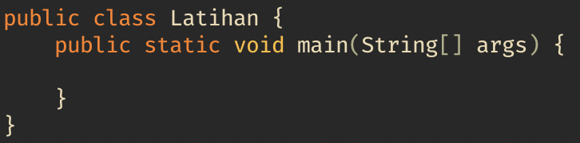
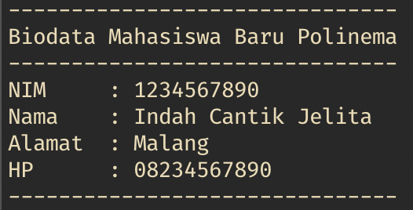

# Bahasa Pemrograman

## Tujuan

- Mahasiswa mengenal konsep program dan bahasa pemrograman
- Mahasiswa mampu melakukan instalasi tools pemrograman Java
- Mahasiswa memahami struktur dasar bahasa pemrograman Java
- Mahasiswa mampu melakukan proses compile dan debug

## Teori Singkat

Java merupakan sebuah bahasa pemrograman yang multiplatform, dapat berjalan di sistem operasi windows, linux, ataupun mac OS. Dengan model aplikasi desktop, web, mobile, serta model aplikasi yang berjalan pada micro processor(Applet).
Untuk membuat sebuah program menggunakan bahasa pemrograman java dibutuhkan 2 komponen utama yaitu Java Development Kit(JDK) dan Java Runtime Environment(JRE).

1. JDK digunakan untuk membuat aplikasi java
2. JRE digunakan menjalankan aplikasi yang telah kita buat.

Di bawah ini adalah arsitektur bahasa pemrograman java


[sumber: https://medium.com/](https://medium.com/@mannverma/the-secret-of-java-jdk-jre-jvm-difference-fa35201650ca)

Pada gambar di atas terdapat Java Virtual Machine, merupakan sebuah mesin virtual yang terdapat di dalam sebuah JRE untuk menjalankan file .class.

## Praktikum

### Percobaan 1: Melakukan Instalasi Java Development Kit/JDK

1. Unduh JDK pada alamat tautan berikut: [Download JDK](https://www.oracle.com/technetwork/java/javase/downloads/index.html)

2. Klik dua kali pada file instalasi yang sudah diunduh kemudian ikuti instruksi proses instalasinya.

3. Langkah selanjutnya adalah pengaturan **PATH** (langkah ini khusus untuk
   sistem operasi Windows), sehingga perintah java dapat dikenali.

4. Cara melakukan pengaturan **PATH** dengan membuka **Control Panel** ->
   **System** -> **Advanced System Setting** -> **Environment Variable**.
   Kemudian cari variabel **PATH**.

   > **Catatan**: jika variabel **PATH** tidak ditemukan, silahkan anda
   > menambahkan variabel tersebut.

5. Langkah selanjutnya adalah mengisi variabel **PATH**, jika variabel **PATH**
   sudah ada isinya jangan menghapus nilai yang sudah ada tetapi tambahkan
   `C:\Program Files\Java\jdk\bin` (sebagai pemisah antar nilai gunakan karakter
   `;`, khusus untuk sistem operasi di bawah Windows 10)

   > **Catatan**: Lokasi nilai JDK yang ditambahkan sesuaikan dengan direktori dimana
   > program Java terinstall, pada contoh langkah di atas JDK terinstall pada
   > `C:\Program Files\Java\jdk\bin`

6. Buka Command Prompt (`Win + R`, kemudian ketik `cmd`), selanjutnya ketikan
   perintah `javac`. Jika perintah tersebut dikenali maka lingkungan sistem
   operasi Windows telah mendukung program java. Tetapi jika belum dikenali
   lakukan pengecekan pada pengaturan **PATH** (kemungkinan ada kesalahan ketika
   memasukkan lokasi direktori bin pada variable **PATH**)

### Pertanyaan

1. Jelaskan apa kegunaan memasukkan lokasi direktori bin dari Java ke dalam
   variabel **PATH**!
2. Jelaskan kegunaan perintah `javac` ketika masuk di command prompt!

### Percobaan 2: Struktur Dasar Bahasa Pemrograman Java

1. Lakukan instalasi Text Editor, Visual Studio Code (direkomendasikan),
   Sublime, Atom, atau Notepad++ (pilih salah satu saja).

   > **Catatan**: Jika anda menggunakan **Visual Studio Code** silahkan tambahkan
   > extension [Java Extension Pack](vscode:extension/vscjava.vscode-java-pack)

2. Buka Text Editor yang sudah terinstall, kemudian buatlah file baru dan simpan
   dengan nama `Latihan.java` (Huruf L menggunakan huruf kapital).

3. Tuliskan kode program berikut yang merupakan struktur dasar bahasa
   pemrograman Java:

  

  > **Keterangan**:
  > - `public` adalah *keyword* di Java yang menandakan bahwa class, obyek,
  >  method atau atribut dapat diakses dari class lain.
  > - `class` adalah *keyword* di Java yang digunakan untuk membuat sebuah class.
  > - `static` pada method menandakan, untuk memanggil method tersebut tidak
  >  diperlukan proses intansiasi.
  > - `void` menandakan sebuah method tidak mempunyai *return value* (nilai
  >  kembalian).
  > - Penamaan `class` dengan nama file harus sama persis (case sensitive).

  ```java
  public static void main(String[] args){
  }
  ```

   Potongan kode di atas merupakan sebuah pintu masuk compiler untuk melakukan compile kode java, compile adalah proses mengubah kode java(*.java) menjadi
   bahasa mesin atau byte kode yang tidak bisa dibaca dengan editor biasa. Dalam sebuah file java hanya diizinkan memiliki 1 potongan kode diatas.

   > **Catatan**: case sensitive maksudnya adalah java memperlakukan antara huruf besar dan huruf kecil berbeda.
   >contohnya; makan, Makan, dan MakaN adalah berbeda.

4. Simpan kode program tersebut (File->Save)
5. Buka Command Prompt dan masuk ke lokasi folder dimana file `Latihan.java`
   tersimpan. Untuk pindah drive (khusus Windows), ketik nama label drive
   diikuti tanda `:`.Untuk pindah ke direktori, anda dapat menggunakan perintah
   `cd` diikuti dengan nama direkori tujuan. Misalnya file `Latihan.java`
   disimpan pada `D:\Kuliah\Pemrograman` maka anda harus menuliskan perintah
   berikut:

   ```
   D:

   cd Kuliah\Pemrograman
   ```

   > **Tips**: Jika anda menggunakan **Visual Studio Code** anda dapat menggunakan
   > integrated terminal dengan menekan shortcut **ctrl + `**

6. Setelah anda masuk dalam direktori tempat menyimpan file `Latihan.java`. Maka
   langkah selanjutnya adalah melakukan proses *compile* dengan menggunakan
   perintah `javac`. Secara umum perintah ini menggunakan format:

   ```
   javac NamaFile.java
   ```

   Sehingga untuk melakukan proses *compile* pada file `Latihan.java` menjadi:

   ```
   javac Latihan.java
   ```

7. Jika proses kompilasi selesai dan tidak ada *error* (ditandai dengan tidak
   adanya output) maka akan dihasilkan file baru dengan nama `Latihan.class`
   (buka dan cek pada direktori tempat anda menyimpan file `Latihan.java`).

8. Untuk menjalankan program yang telah dikompilasi, gunakan perintah `java
   NamaClass` (tanpa menggunakan ekstensi `.class`).

   ```
   java Latihan
   ```

9. Jika anda amati, maka tidak ada output yang ditampilkan pada layar command
   prompt. Hal ini dikarenakan kode program yang dituliskan hanya berupa
   struktur dasar program Java.

10. Lakukan modifikasi pada file `Latihan.java` dengan menambahkan kode berikut
    ini! Letakkan kode tersebut pada blok `main`.

    ```java
    System.out.println("Hello Dasar Pemrograman");
    ```

    Sehingga hasil kode akhirnya menjadi:
    ```java
    public class Latihan {
      public static void main(String[] args) {
        System.out.println("Hello Dasar Pemrograman");
      }
    }
    ```

    > **Catatan**: indentasi (tab) pada kode program digunakan untuk memudahkan
    > blok kode program.

11. Simpan kembali file tersebut (File->Save)
12. Lakukan kompilasi seperti pada langkah ke-6.
13. Jika tidak ada error maka jalankan program seperti pada langkah ke-8.
14. Amatilah hasil output kode program tersebut!

### Pertanyaan

1. Jelaskan fungsi perintah `javac Latihan.java` pada percobaan di atas!
2. Jelaskan fungsi perintah `java Latihan` pada percobaan di atas!
3. Jelaskan fungsi kode program `System.out.println("Hello Dasar Pemrograman");`
4. Tambahkan instruksi kode program `System.out.println("Saya suka pemrograman");`. Letakkan di bawah baris perintah `System.out.println("Hello Dasar Pemrograman");`. Jalankan program tersebut dan jelaskan bagaimana hasil outputnya!
5. Gantilah semua perintah `System.out.println` menjadi `System.out.print`
   kemudian jalankan program!
6. Apa perbedaan perintah `System.out.println` dengan `System.out.print`.
   Jelaskan!
7. Tambahkan karakter `//` sehingga kode program menjadi `//
   System.out.print("Saya suka pemrograman");` Kemudian jalankan program!
8. Jelaskan fungsi karakter `//` pada pemrograman Java!

## Tugas

Buatlah program Java sederhana dengan hasil output sebagai berikut, kemudian
jalankan program yang telah anda buat!


