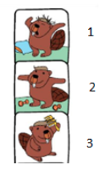
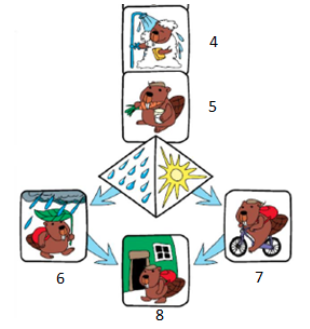
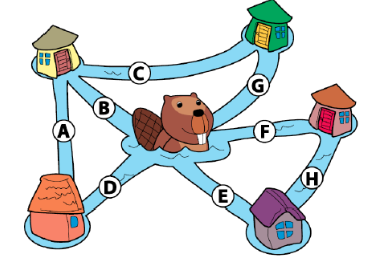
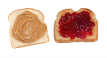
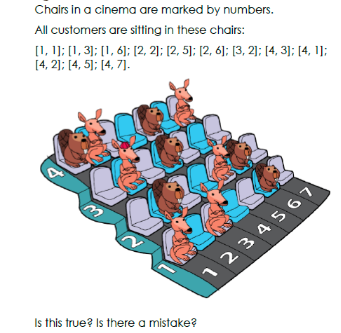
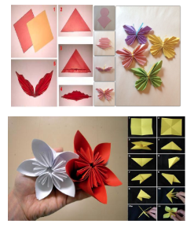
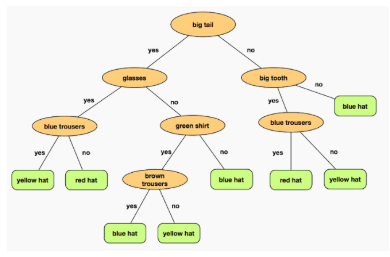
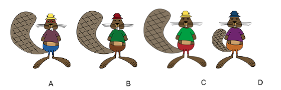
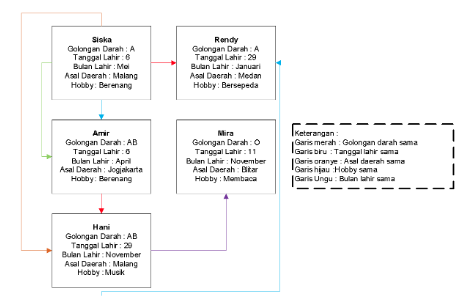

#Studi Kasus

##Tujuan

- Mahasiswa dapat memodelkan permasalahan studi kasus Sequence.
- Mahasiswa dapat memodelkan permasalahan studi kasus Pemilihan.
- Mahasiswa dapat memodelkan permasalahan studi kasus Perulangan.
 
##Ulasan Teori

Algoritma adalah urutan langkah-langkah logis (alur pikiran) dalam menyelesaikan suatu pekerjaan. Dalam algoritma, yang akan melaksanakan alur pikiran tadi adalah komputer. Perintah tersebut dapat diberikan dalam bentuk kumpulan instruksi yang disebut dengan program. Program tersebut tertulis dalam suatu bahasa yang disebut dengan bahasa pemrograman. Suatu program disusun dengan sistematis, artiya urutan langkah-langkah yang disusun harus jelas dengan memiliki pola tertentu. Selain itu suatu program harus logis, masuk akal, bisa dibaca dan diterima oleh akal serta bisa dinilai benar salahnya.
Sebagai tambahan, suatu algoritma harus memenuhi beberapa kriteria berikut:

1. Input

    Terdapat inputan bernilai nol ataupun lebih banyak sebagai sumber yang berasal dari luar  program.

2. Output

    Output minimal terdiri dari satu kuantitas hasil.
    
3. Definiteness

    Setiap instruksi yang diberikan harus jelas dan tidak ambigu.
    
4. Finiteness

    Jika kumpulan instruksi algoritma ditelusuri, maka tahapan algoritma akan berakhir setelah sejumlah langkah yang terbatas.

5. Effectivenes

    Setiap instruksi harus cukup mendasar sehingga mudah untuk dilakukan sesuai dengan kebutuhan
    
Algoritma dinilai dari hasil yang benar sesuai keinginan, menghasilkan output yang baik, serta efisiensi (waktu dan memori) algoritma yang baik pula. Struktur Dasar Algoritma terdiri dari :
1. Struktur runtutan/sekuensial

    Digunakan untuk program yang pernyataannya sequential atau urutan. 
 
2. Struktur pemilihan
    
    Digunakan untuk program yang menggunakan pemilihan atau penyeleksian kondisi. 

3. Struktur perulangan

    Digunakan untuk program yang pernyataannya akan dieksekusi berulang-ulang.
    
 Langkah-langkah pembuatan algoritma secara ringkas sebagai berikut:
 1. Pahami masalah
 2. Tentukan kondisi awal: Data input
 3. Tentukan kondisi akhir: Data output
 4. Data lain (jika ada)
    Data pendukung lain yang dibutuhkan pada proses penyelesaian masalah
 5. Tentukan langkah penyelesaian masalah mulai dari kondisi awal, hingga bisa tercapai kondisi akhir. 
 
    Dalam menyusun langkah mungkin melibatkan:
    
     a. Urutan/sequence
     
     b. Pemilihan
     
     c. Perulangan
     
## Praktikum

### Percobaan 1: Menyelesaikan Studi Kasus Tentang Sequence

1. Setiap pagi gabrielle melakukan rutinitas secara berurutan sesuai gambar 1 berikut.

    <figure style="text-align: center">
              
    </figure>
    
    <figure style="text-align: center">
        
        <figcaption style="text-align: center">Percobaan01-1</figcaption>
    </figure>
    
    Akan tetapi, terdapat 2 rutinitas yang tidak tepat urutanya. Bagaimanakah urutan yang benar?
    
    **Jawaban**
    
    Urutan yang benar adalah 1-2-4-3-5-6/7-8. Penjelasan urutan yang benar sebagai berikut :
    * Gabrielle bangun tidur
    * Kemudian berolahraga
    * Setelah selesai berolahraga dilanjutkan dengan mandi
    * Setelah selesai mandi, gabrielle menyisir rambut
    * Kemudian, dilanjutkan dengan sarapan wortel di pagi hari
    * Jika kondisi hujan, gabrielle akan memakai payung dari daun dan jalan kaki untuk pergi ke sekolah. Jika cerah, bersepeda adalah cara yang dipilih untuk pergi ke sekolah
    * Tahap yang terakhir, sesampai di depan sekolah gabrielle bergegas masuk ke gedung sekolah

2. Selesaikan permasalahan tesebut dengan langkah-langkah logis sesuai dengan ulasan teori yang sudah dijelaskan sebelumnya.

    “Bu Asil adalah salah satu nasabah bank YYY yang menabung sebesar 10 juta rupiah. Bank tersebut memberikan bunga sebesar 1,5% setiap tahun.  Bu Asil menabung selama 5 tahun. Berapakah bunga dan jumlah tabungan yang dapat diambil sekarang?”
    
    **Jawaban**
    
    Input: Jumlah tabungan, bunga setiap bulan, lama menabung
     
    Output: bunga, jumlah tabungan sekarang
    
    Data Lain: -
    
    Proses:
    
    * Masukkan jumlah tabungan, lama menabung, dan prosentase bunga
    * Hitung bunga = lama menabung x prosentase bunga x jumlah tabungan
    * Hitung jumlah tabungan = bunga + jumlah tabungan
    * Output bunga dan jumlah tabungan
    
    Pertanyaan
    1. Sebutkan secara terurut rutinitas yang Anda lakukan di pagi hari seperti percobaan 1 soal ke-1!
    2. Sebutkan secara terurut rutinitas yang Anda lakukan sepulang kuliah seperti percobaan 1 soal ke-1!
    3. Hitunglah secara matematis hasil dari percobaan 1 soal ke-2! Berapakah hasilnya?
    4. Jika terdapat informasi tambahan mengenai biaya administrasi sebesar 12 ribu per bulan untuk soal ke-2 percobaan 1. Tuliskan kembali langkah-langkah pembuatan algoritma yang benar! Berapakah jumlah tabungan yang dapat diambil?
    5. Setelah data tambahan soal no.4 berapakah tabungan yang bisa diambil ibu Asil setelah 7 tahun?
    
### Percobaan 2: Menyelesaikan Studi Kasus Tentang Pemilihan

Pada ilustrasi gambar 2 berikut, beaver ingin berenang menyebrang seluruh sungai yang ada. Tetapi beaver hanya diijinkan satu kali saja melewati setiap sungai yang ada. Bagaimana lintasan yang harus dilalui beaver?Gunakan algoritma untuk menyelesaikan permasalahan yang dialami beaver!

<figure style="text-align: center">
    
    <figcaption style="text-align: center">Percobaan02-1</figcaption>
</figure>

Jawaban

Input		: Sungai, Informasi keterhubungan sungai (Contohnya A berdekatan dengan B dan D)
                            
Output		: Lintasan seluruh sungai

Data Lain	: -

Proses		:

* Beaver berada ditengah-tengah beberapa pertemuan sungai. Dia dapat berenang mulai dari sungai B/D/E/F/G
* Jika dimulai dari B maka lintasan yang dapat dilalui dengan memilih sungai A atau C.

Jika melewati sungai A, maka :
* Sungai A dilanjutkan ke sungai D
* Dari D memiliki pilihan ke sungai E/F/G. Jika memilih F atau G maka kemungkinan satu sungai harus dilewati lebih dari satu kali. Maka dipilihlah sungai E
* Dari E dilanjutkan ke sungai yang terhubung dan searah yaitu sungai H
* Dari sungai H dilanjutkan ke sungai yang berhubungan dan searah yaitu F-G-C
* Jadi lintasan yang dilalui Beaver adalah B-C-G-F-H-E-D-A (output)

Jika melewati sungai C, maka......
* Jika dimulai dari D maka lintasan yang dapat dilalui....
* Jika dimulai dari E maka lintasan yang dapat dilalui...
* Jika dimulai dari F maka lintasan yang dapat dilalui...
* Jika dimulai dari G maka lintasa yang dapat dilalui...

Pertanyaan!
1. Tulis ulang dan lengkapi algoritma yang ada pada percobaan 2!
2. Tuliskan algoritma tentang peraturan SP1, SP2, dan SP3 di JTI Polinema sesuai yang Anda ketahui!

### Percobaan 3: Menyelesaikan Studi Kasus Tentang Perulangan

1. Terdapat studi kasus mengenai perulangan sebagai berikut :

   Ani sedang berulang tahun hari ini. Ibu Ani ingin membagi sedikit rejeki untuk teman-teman sekelas Ani. Sejak subuh Ibu Ani sudah menyiapkan 50 pasang roti tawar gandum, satu botol selai kaca dan satu botol selai strawberry untuk membuat sandwich. Karena tidak tahu secara pasti siapakah teman-teman Ani yang suka selai kacang atau lebih memilih selai strawberry. Maka ibu Ani berencana menyiapkan sandwich dengan selai kacang sebanyak 23 dan sisanya roti roti tawar dengan selai strawberry.
   
   <figure style="text-align: center">
        
        <figcaption style="text-align: center">Percobaan03-1</figcaption>
   </figure>
   
   Bagaimanakah algoritma untuk menyiapkan roti tersebut?
   
   Jawaban
   
   Input: Jumlah roti tawar, Jumlah Sandwich dengan selai Kacang, Jumlah Sandwich dengan selai strawberry
   
   Output: Sandwich
   
   Data Lain : -
   
   Proses:
   
   * Siapkan Bahan untuk membuat sandwich
   * Ambil pisau
   * Oleskan selai kacang dengan pisau di permukaan roti tawar dengan selai kacang sesuai jumlah yang diinginkan
   * Oleskan selai strawberry dengan pisau di permukaan roti tawar dengan selai kacang sesuai jumlah yang diinginkan (Jumlah roti tawar – jumlah sandwich dengan selai kacang)
   * Sandwich siap disajikan (output)
   
2. Terdapat suatu studi kasus sesuai gambar 4 berikut:

    <figure style="text-align: center">
        
        <figcaption style="text-align: center">Percobaan03-2</figcaption>
    </figure>
    
    Bagaimanakah algoritma untuk menyelesaikan permasalahan tersebut?
    
    Jawaban
    
    Input		: Posisi duduk customers (baris, kolom), jumlah baris, jumlah kolom
    
    Output		: Posisi duduk semua customers
    
    Data Lain	: -
    
    Proses		:
    * Lakukan pengecekan secara berulang-ulang mulai dari baris pertama untuk kolom ke-1 sampai dengan ke-7
    * Simpan informasi posisi duduk customer pada baris ke-1
    * Lakukan pengecekan secara berulang-ulang mulai dari baris kedua untuk kolom ke-1 sampai dengan ke-7
    * Simpan informasi posisi duduk customer pada baris ke-2
    * Lakukan pengecekan secara berulang-ulang mulai dari baris ketiga untuk kolom ke-1 sampai dengan ke-7
    * Simpan informasi posisi duduk customer pada baris ke-3
    * Lakukan pengecekan secara berulang-ulang mulai dari baris keempat untuk kolom ke-1 sampai dengan ke-7
    * Simpan informasi posisi duduk customer pada baris ke-4
    * Keluarkan informasi posisi duduk semua customer yang sudah terdeteksi (Output)
    
    Pertanyaan
    1. Sebutkan posisi yang dideteksi salah pada percobaan 3 soal ke-2!
    2. Sebutkan 5 hal yang menggunakan konsep perulangan sesuai kejadian yang pernah Anda temui!

## Tugas
1. Buatlah ormanen dari kertas yang Anda miliki sekarang(tidak harus kertas warna)! Bentuk ornamen bebas setiap mahasiswa. Sebutkan algoritmanya menggunakan input, proses dan output ataupun data lain seperti soal-soal pada bagian praktikum. Lampirkan foto ornamen yang dibuat pada jawaban jobsheet, dan kumpulkan ornamen yang sudah dibuat di meja dosen.

    <figure style="text-align: center">
        
        <figcaption style="text-align: center">Tugas 01</figcaption>
    </figure>
    
2. Sebelum menjawab pertanyaan pada soal berikut, buat terlebh dahulu algoritmanya. Terdapat seekor berang-berang yang memiliki ketentuan tentang pakaian yang dikenakan. Aturan tersebut sesuai dengan gambar 6 berikut ini:

    <figure style="text-align: center">
        
        <figcaption style="text-align: center">Tugas 02</figcaption>
    </figure>
    
    Sesuai dengan aturan di atas. Manakah tupai di bawah ini yang memakai pakaian **tidak sesuai** dengan ketentuan?
    
    <figure style="text-align: center">
        
        <figcaption style="text-align: center">Tugas 03</figcaption>
    </figure>
     
3. Lakukan wawancara dengan mahasiswa dalam satu kelas (Pilihlah 10-15 orang mahasiswa) yang sama dengan Anda! Catat informasi mengenai nama panggilan, golongan darah, tanggal lahir, bulan lahir, asal daerah, hobby. Sajikan informasi tersebut dalam suatu jaringan seperti contoh berikut (media pembuat jaringan bebas)

    <figure style="text-align: center">
        
        <figcaption style="text-align: center">Tugas 04</figcaption>
    </figure>
    
    * Kemudian jawablah beberapa pertanyaan berikut:
    * Siapakah yang memiliki golongan darah sama dengan Anda?
    * Siapakah yang lahir pada bulan yang sama dengan Anda?
    * Siapa yang lahir pada tanggal yang sama dengan Anda?
    * Siapakah yang berasal dari daerah yang sama dengan Anda?
    * Siapakah yang memiliki hobby sama dengan Anda?
4. Buatlah algoritma untuk menghitung luas permukaan tabung!

