# Jobsheet 05 - SINTAKS PEMILIHAN 1

### Tujuan

Mahasiswa mampu menyelesaikan permasalahan/studi kasus menggunakan sintaks pemilihan 1 dan mengimplemantasikannya dalam bahasa pemrogaman java.

### Alat dan Bahan

1.	PC/Laptop
2.	Text Editor (Nebteans)
3.	JDK

### Ulasan Teori

Pada kehidupan sehari-hari kita selalu mengambil keputusan dengan mempertimbangkan berbagai hal/kondisi-kondisi. Sintaks pemilihan adalah statement pemilihan yang digunakan untuk mengatur kapan suatu perintah akan dijalankan. Dengan statement ini kita bisa mengatur kapan suatu perintah akan dijalankan, yaitu ketika telah dipenuhinya suatu syarat tertentu. Misalnya:
>Jika **nilai lebih dari 70** maka **Diterima**

Pernyataan di atas mengandung sebab akibat. Bila dilihat, keterangan “nilai lebih dari 70” adalah merupakan suatu syarat, sedangakan “DITERIMA” ini akan dilakukan apabila syaratnya terpenuhi atau “nilai lebih dari 70”. Dalam dunia logika, istilah **terpenuhinya syarat** dapat dikatakan **syarat tersebut bernilai benar atau TRUE**. Selanjutnya pernyataan “jika…maka…” dapat diadopsi dalam programming. Untuk menyatakan pernyataan tersebut dalam programming, maka dapat digunakan statement sintaks pemilihan. Pada pembahasan di materi sintaks pemilihan 1 ini akan dipelajari tiga macam sintaks pemilihan yaitu `if, if-else, if else if else dan switch..case`.

#### Sintaks Pemilihan `if`

   Bentuk umum:

   <figure style="text-align: center">
          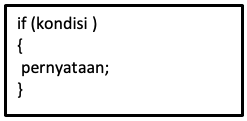
          <figcaption style="text-align: center; font-weight: bold">Bentuk umum if</figcaption>
      </figure>
      
   <figure style="text-align: center">
                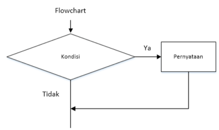
                <figcaption style="text-align: center; font-weight: bold">Flowchart If</figcaption>
      </figure>

   > - Apabila kondisi bernilai benar, maka pernyataan akan dilaksanakan.
   > - Apabila kondisi bernilai salah, maka pernyataan tidak akan dilaksanakan.

   Pada sintaks pemilihan 1 ini, kita akan menggunakan operator hubungan (relational operator). Berikut ini operator hubungan dalam bahasa pemrograman java:

   | Simbol Operator         | Keterangan |
   | ------------------------| ---------- |
   | ==                      | Sama dengan (Equal to) |
   | >                       | Lebih besar dari (Greater than)      |
   | <                       | Lebih kecil dari (Less than)  |
   | >=                      | Lebih besar atau sama dengan (Greater than or Equal to)    |
   | <=                      | Lebih kecil dari atau sama dengan (Less than or Equal to)    |
   | !=                      | Tidak sama dengan (Not Equal to) |
    
   Implementasi atau penggunaan operator hubungan pada sintaks pemilihan adalah sebagai berikut:

<figure style="text-align: center">
                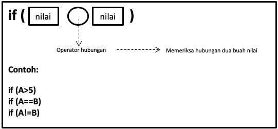
                <figcaption style="text-align: center; font-weight: bold">Penggunaan Operator</figcaption>
      </figure>

**Contoh program:**

<figure style="text-align: center">
                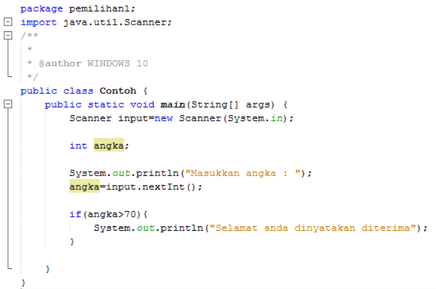
      </figure>
      
Ketika program diatas di jalankan dan kita masukkan angka 80 maka akan keluar tampilan “selamat anda dinyatakan diterima” hal ini disebabkan karena terdapat sebuah kondisi yang menyatakan bahwa jika nilai lebih dari 70 (>70) maka akan tampil “selamat anda dinyatakan diterima”, sedangkan jika kita masukkan angka 70 atau kurang dari 70 maka tidak akan terdapat tampilan apapun.

**Output:**

<figure style="text-align: center">
                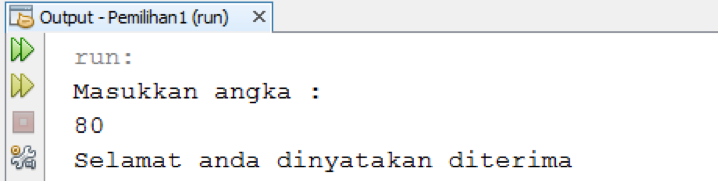
      </figure>
      
   <figure style="text-align: center">
                      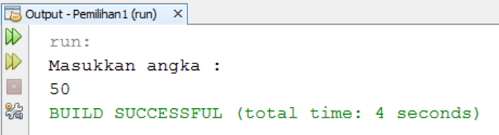
            </figure>

#### Sintaks Pemilihan `if-else`
Bentuk umum:

<figure style="text-align: center">
                      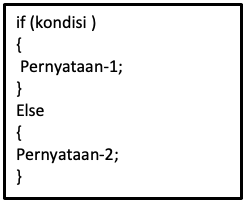
            </figure>
            
<figure style="text-align: center">
                      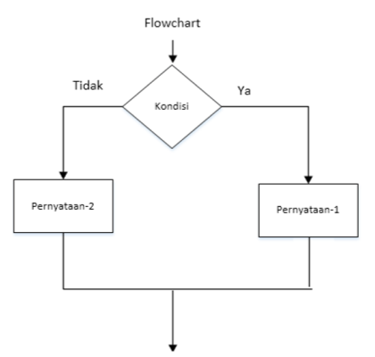
                      <figcaption style="text-align: center; font-weight: bold">Flowchart if-else</figcaption>
            </figure>

Struktur ini minimal memiliki 2 pernyataan. Jika kondisi yang diperiksa bernilai benar atau terpenuhi maka pernyataan pertama yang akan dilaksanakan dan jika kondisi yang diperiksa bernilai salah maka pernyataan yang kedua yang akan dilaksanakan.

**Contoh program:**

<figure style="text-align: center">
                      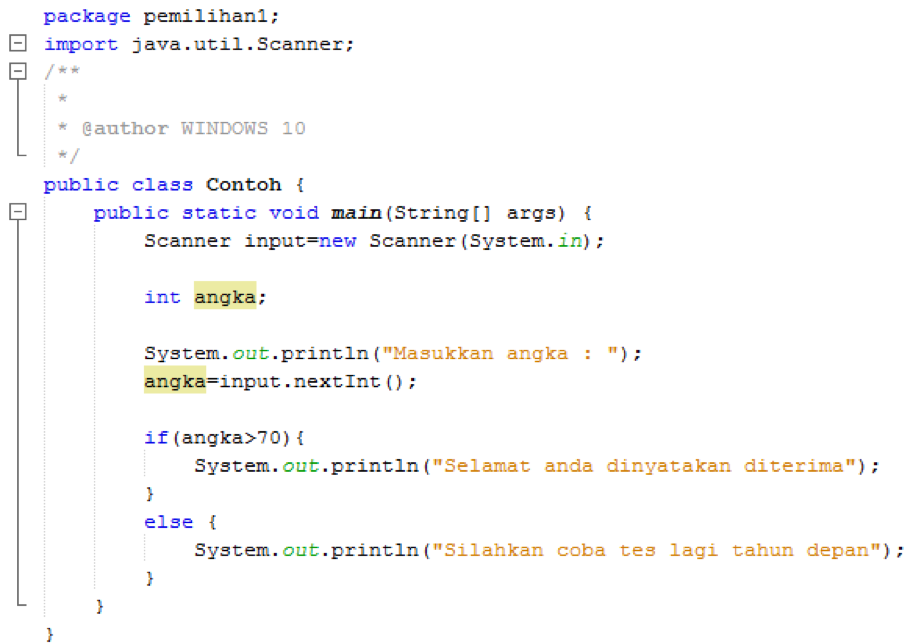
            </figure>

Pada contoh program `if-else` diatas tambahkan kode program

<figure style="text-align: center">
                      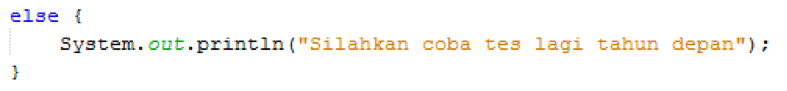
            </figure>

Sehingga ketika angka yang dimasukkan nilainya 70 atau kurang dari 70 maka akan muncul tampilan “Silahkan coba tes lagi tahun depan”

**Output:**
<figure style="text-align: center">
                      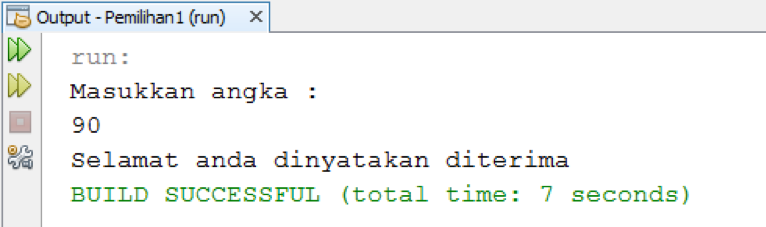
            </figure>

<figure style="text-align: center">
                      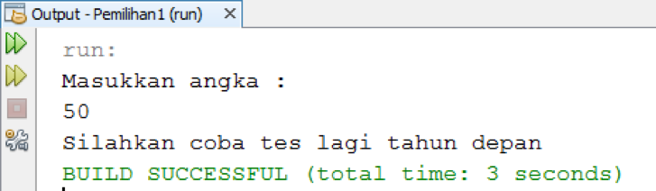
            </figure>

#### Sintaks Pemilihan `if... else if...else`
Bentuk umum:
<figure style="text-align: center">
                      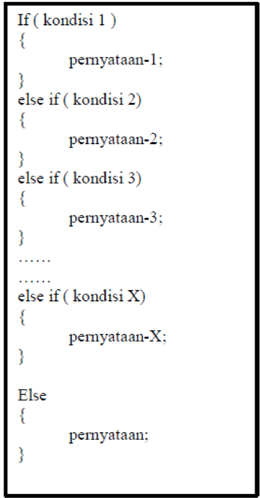
            </figure>
            
<figure style="text-align: center">
    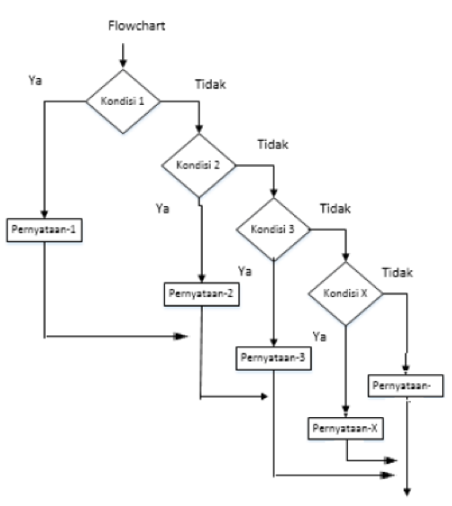
    <figcaption style="text-align: center; font-weight: bold">Flowchart if else-if else</figcaption>
</figure>

Pada bentuk `if else-if else` diatas, pernyataan 1 akan dijalankan apabila “kondisi 1” bernilai BENAR. JIka “kondisi 1” bernilai SALAH, maka akan dicek “kondisi 2”. Jika “kondisi 2” BENAR maka akan dijalankan statement 2, begitu seterusnya. Dan apabila tidak ada satupun syarat yang terpenuhi, barulah statement X akan dikerjakan.
Contoh program:

<figure style="text-align: center">
    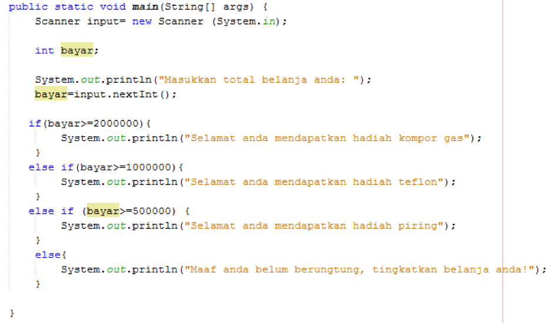
</figure>

#### Sintaks Pemilihan `switch...case`

Sintaks pemilihan ini digunakan untuk penyelesaian kondisi dengan kemungkinan yang terjadi cukup banyak. Struktur ini akan melaksanakan salah satu dari beberapa pernyataan `“case”` tergantung nilai kondisi yang ada di dalam `switch`. Selanjutnya proses diteruskan hingga ditemukan pernyataan `“break”`. Jika tidak ada nilai pada case yang sesuai dengan nilai kondisi, maka proses akan diteruskan kepada pernyataan yang ada di bawah `“default”`.
Bentuk umum:

<figure style="text-align: center">
    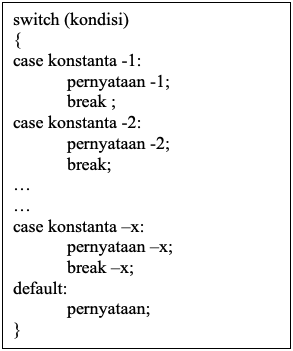
</figure>

Contoh program:

<figure style="text-align: center">
    
    <figcaption style="text-align: center; font-weight: bold">Flowchart switch-case</figcaption>
</figure>

Pada contoh program `switch case` diatas jika dimasukkan angka 1 maka outputnya “kelas 1” dan seterusnya sampai angka 4. Jika inputan selain angka 1 s/d 4 maka outputnya adalah “kode yang anda masukkan salah”
Output:

<figure style="text-align: center">
    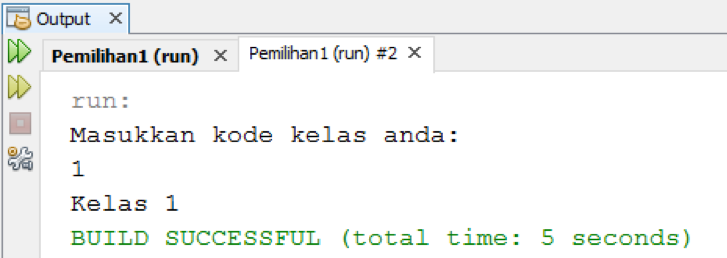
</figure>

### Langkah Praktikum
Ikuti langkah-langkah praktikum berikut ini.

#### Praktikum 1

1.	Perhatikan flowchart dibawah ini!

   <figure style="text-align: center">
        
    </figure>

   Flowchart diatas digunakan untuk menentukan bilangan ganjil/genap, selanjutnya kita akan membuat programnya berdasarkan flowchart di atas!
2.	Buka Netbeans yang sudah anda install
3.	Buat project baru dengan nama “Pemilihan1” dengan cara `File -> New Project -> Java Application ->Next ->Pemilihan1 ->Finish`
   <figure style="text-align: center">
        
        <figcaption style="text-align: center; font-weight: bold">New Project</figcaption>
    </figure>
    
   <figure style="text-align: center">
        
        <figcaption style="text-align: center; font-weight: bold">Java Application</figcaption>
    </figure>
    
   <figure style="text-align: center">
        
        <figcaption style="text-align: center; font-weight: bold">Project Name</figcaption>
    </figure>

4.	Maka akan terdapat 1 buat project dengan nama Pemilihan 1 dan didalamnya terdapat 1 file dengan nama `Pemilihan1.java`

   <figure style="text-align: center">
        
    </figure>

5.	Tambahkan import library Scanner. 
6.	Deklarasikan Scanner:

   <figure style="text-align: center">
        
    </figure>

7.	Buatlah variabel bertipe int dengan nama bil

   <figure style="text-align: center">
        
    </figure>

8.	Tambahkan kode berikut ini untuk menerima inputan dari keyboard:

   <figure style="text-align: center">
        
    </figure>

9.	Buatlah struktur kondisi untuk mengecek apakah bilangan tersebut merupakan bilangan genap atau ganjil

   <figure style="text-align: center">
        
    </figure>

10.	Jalankan program, maka outputnya adalah sebagai berikut:

   <figure style="text-align: center">
        
    </figure>

##### Pertanyaan!

1.	Modifikasi program diatas dibagian struktur pemilihannya sehingga menjadi sebagai berikut:

   <figure style="text-align: center">
        
    </figure>

2.	Jalankan dan amatilah hasilnya!
3.	Jelaskan mengapa output program yang dimodifikasi sama dengan output program sebelum dimodifikasi!

#### Praktikum 2

1.	Buat file baru beri nama “Percobaan2.java” di project  “Pemilihan1”.

   <figure style="text-align: center">
        
    </figure>

   <figure style="text-align: center">
        
    </figure>

2.	Tambahakan library `Scanner`.
3.	Buatlah deklarasi `Scanner`.
4.	Buat variabel nilai bertipe int.

   <figure style="text-align: center">
        
    </figure>

5.	Tuliskan perintah untuk memasukkan inputan.

   <figure style="text-align: center">
        
    </figure>

6.	Tambahkan kode program kondisi dibawah ini

   <figure style="text-align: center">
        
    </figure>

7.	Jalankan program. Amati apa yang terjadi!

##### Pertanyaan
1.	Jelaskan fungsi kode program berikut:
   ```java
    nilai+=10;
    nilai+=10;
   ```
2.	Modifikasilah program diatas dimana inputannya yang awalnya hanya satu kemudian diganti 2 inputan (misal : nilai1 dan nilai2), lakukan perhitungan rata-rata kedua nilai tersebut jika nilainya lebih dari sama dengan 100 maka dikurangi 5, sedangkan jika nilai rata-rata tersebut kurang dari 100 maka akan langsung dicetak!

#### Praktikum 3

1.	Buat file baru beri nama “Percobaan3.java” di project  “Pemilihan1”. 
2.	Tambahakan library Scanner.
3.	Buatlah deklarasi Scanner.
4.	Buat variabel umur bertipe int.

   ```java
    int umur;
   ```

5.	Tuliskan perintah untuk memasukkan inputan.

   ```java
    System.out.println("Masukkan umur Anda: ");
    umur = input.nextInt();
   ```

6.	Tambahkan kode program kondisi dibawah ini

   ```java
    if(umur > 60){
       System.out.println("Lansia");
    } else if(umur > 45){
       System.out.println("Tua");
    }else if(umur > 17){
       System.out.println("Dewasa");
    }else if(umur > 5){
       System.out.println("Anak-anak");
    }else{
       System.out.println("Balita");
    }
   ```

7.	Jalankan program. Amati apa yang terjadi!

##### Pertanyaan
1.	Berapa jumlah kondisi yang ada pada program di percobaan 3? Jelaskan!
2.	Modifikasi program diatas sehingga jika umur yang dimasukkan 0 tahun atau kurang dari 0 akan tampil output “Maaf umur yang anda masukkan salah”!

#### Praktikum 4
1.	Buat file baru beri nama “Percobaan4.java” di project  “Pemilihan1”. 
2.	Tambahakan library Scanner.
3.	Buatlah deklarasi Scanner.
4.	Buat variabel-variabel berikut:

   ```java
       double angka1, angka2, hasil;
       char operator;
   ```

5.	Tuliskan perintah untuk memasukkan inputan.
   ```java
       System.out.println("Masukkan angka pertama: ");
       angka1 = sc.nextDouble();
       System.out.println("Masukkan angka kedua: ");
       angka2 = sc.nextDouble();
       System.out.println("Masukkan operator (+ - * /): ");
       operator = sc.next().chartAt(0);
   ```

6.	Tambahkan kode program kondisi dibawah ini

   ```java
       switch(operator){
            case '+':
            hasil = angka1 + angka2;
            System.out.println(angka1 + " + " + angka2 + "=" + hasil);
            break;
            case '-':
            hasil = angka1 - angka2;
            System.out.println(angka1 + " - " + angka2 + "=" + hasil);
            break;
            case '*':
            hasil = angka1 * angka2;
            System.out.println(angka1 + " * " + angka2 + "=" + hasil);
            break;
            case '/':
            hasil = angka1 / angka2;
            System.out.println(angka1 + " / " + angka2 + "=" + hasil);
            break;
       }
   ```

7.	Jalankan program. Amati apa yang terjadi!

##### Pertanyaan

1.	Jelaskan fungsi dari break dan default pada percobaan 4 diatas!
2.	Jelaskan fungsi perintah kode program dibawah ini pada percobaan 4!
   ```java
       operator = sc.next().chartAt(0);
   ```

#### Tugas

1.	Buatlah program untuk menginputkan dua buah bilangan bulat, kemudian mencetak salah satu bilangan yang nilainya terbesar. 
2.	Perhatikan flowchart berikut ini:

   <figure style="text-align: center">
        
    </figure>

Buatlah program sesuai dengan flowchart diatas!

3.	Pada akhir semester seorang dosen menghitung nilai akhir dari mahasiswa yang terdiri dari nilai uas, uts, kuis, dan tugas. Nilai akhir didapatkan dari 40% nilai uas, 30% nilai uts, 10% nilai kuis, dan 20% nilai tugas. Jika nilai akhir dari mahasiswa dibawah 65 maka mahasiswa tersebut akan mendapatkan remidi. Buatlah program untuk membantu mengetahui mahasiswa yang mendapatkan remidi berdasarkan nilai akhir yang didapatkannya!

4.	PT. Raharja merupakan perusahaan yang bergerak dibidang textile. Total gaji yang diterima oleh karyawan di perusahaan tersebut adalah 

   > **Total gaji= gaji pokok + uang makan + uang transport**

   Jika total gaji yang diterima oleh karyawan lebih dari sama dengan Rp. 1.000.000 maka dikenakan pajak 10%, tetapi untuk total gaji karyawan yang dibawah Rp.1.000.000 tidak akan dikenakan pajak. Buatlah program untuk membantu PT.Raharja menghitung gaji bersih yang diterima oleh masing-masing karyawan!

5.	Sebuah toko menyediakan fasilitas member untuk memberikan diskon kepada pelanggannya. Terdapat 3 kategori member yaitu: Silver, Gold, dan Platinum. Setiap total belanja yang sesuai ketentuan katagori member akan mendapatkan diskon spesial sesuai dengan ketentuan berikut:

| Total belanja         | Jenis potongan member | Potongan  |
| ----------------------| --------------------- | --------  |
| >Rp. 200.000,00       | Silver                | 2%        |
| >Rp. 500.000,00       | Gold                  | 5%        |
| >Rp. 1.000.000,00     | Platinum              | 10%       |

   **Output:**
    
   <figure style="text-align: left">
        
    </figure>
    
   <figure style="text-align: left">
        
    </figure>
    
   <figure style="text-align: left">
        
   </figure>
    
   <figure style="text-align: left">
        
    </figure>


