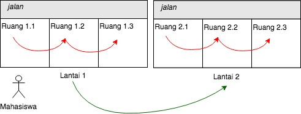
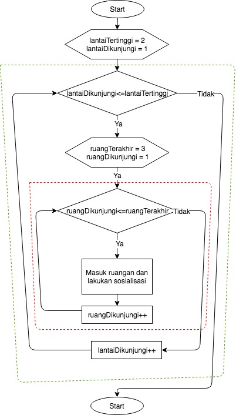
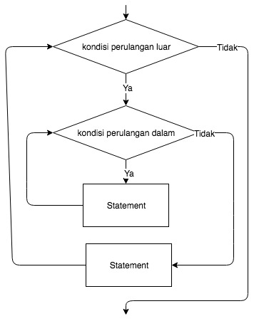
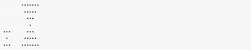
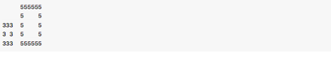
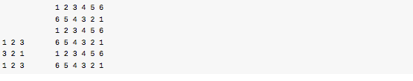
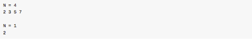

# Sintaks Perulangan 2

## Tujuan

-	Mahasiswa memahami konsep perulangan bersarang

-	Mahasiswa mampu menggambarkan flowchart perulangan bersarang

-	Mahasiswa mampu membuat program perulangan bersarang dalam bahasa Java


##	Alat Dan Bahan
1.	PC/Laptop
2.	JDK
3.	Netbeans IDE (IDE Java)

##	Ulasan Teori

### Pengertian Perulangan Bersarang (Nested Loop)

Pada bahasan sebelumnya, telah dibahas tentang konsep dasar perulangan. Pada
bahasan tersebut disebutkan bahwa logika perulangan digunakan untuk melakukan
beberapa proses atau statement program secara berulang-ulang, dengan suatu pola
tertentu. Pada perulangan, proses atau satetement akan terus dilakukan atau akan
terus diulang, selama kondisi perulangan bernilai benar/true. Dan sebaliknya,
perulangan akan berhenti dan proses atau statement tidak akan dieksekusi lagi
ketika kondisi perulangan bernilai salah/false. Jadi, dalam logika perulangan,
suatu kondisi perulangan diperlukan untuk menentukan apakah suatu perulangan
masih akan akan berlangsung lagi atau harus berhenti.

Perulangan bersarang (nested loop) adalah struktur perulangan yang berada di
dalam perulangan lainnya. Pada umumnya, struktur perulangan yang berada di dalam
perulangan lainnya tersebut memiliki hubungan yang saling terkait dalam
menyesuaikan sebuah kasus. Pada dasarnya tidak ada batasan dalam jumlah
perulangan bersarang. Tetapi sebaiknya tidak terlalu dalam, untuk menghindari
kompleksitas yang tinggi serta alur program menjadi lebih sukar untuk dipahami.

Sebagai ilustrasi sederhana tentang cara kerja perulangan bersarang, misalkan
ada seorang mahasiswa yang hendak mensosialisasikan organisasi kemahasiswaan
kepada mahasiswa-mahasiswa yang saat itu sedang ada di ruang kelas di lantai 1
dan lantai 2. Di lantai 1 ada 3 ruang dan demikian juga di lantai 2. Dan tentu
saja, mahasiswa tersebut harus pergi ke lantai 1 dan lantai 2. Dan misalkan ada
lantai 3, 4 dan seterusnya, maka mahasiswa tersebut juga harus mengunjungi
setiap lantai selanjutnya, yaitu lantai 3 dan lanai 4 juga bukan? Hal tersebut
menggambarkan suatu proses perulangan untuk berkunjung ke setiap lantai, dan
kita sebut saja perulangan luar (outer loop). Kemudian, setelah dia sampai di
lantai 1, apa yang selanjutnya dilakukan? Tentu saja ia mulai masuk mulai
ruangan 1.1, 1.2 dan selanjutnya 1.3. Dan hal tersebut juga menggambarkan suatu
proses perulangan yang lain bukan? Kita sebut saja sebagai perulangan dalam
(inner loop), dimana inner loop ini berada di dalam outer loop. Setelah semua
ruang di lantai 1 telah selesai dikunjungi (inner loop telah selesai
dilakukan/dijalankan), maka ia melanjutkan ke lantai 2 (melanjutkan lagi pada
tahap perulangan selanjutnya untuk outer loop). Dan setelah sampai di lantai 2,
maka ia mulai lagi untuk masuk ke ruangan satu persatu mulai 2.1, 2.2 dan 2.3
(mulai lagi untuk menjalankan inner loop, persis seperti yang sebelumnya telah
dilakukan).



Gambar 1. Ilustrasi Mahasiswa Berkunjung ke Semua Ruang di Lantai 1 dan 2

Jika digambarkan dalam flowchart maka ilustrasi di atas akan tampak seperti
Gambar 2. Area yang bergaris merah disebut dengan inner loop, sedangkan area
yang bergaris hijau adalah outer loop.



Gambar 2. Flowchart Mahasiswa Berkunjung ke Semua Ruang di Lantai 1 dan 2

### Bentuk Umum

Secara umum dan sederhana flowchart perulangan bersarang ditunjukan pada Gambar
3. Pada gambar tersebut terlihat terdapat perulangan dalam yang berada di dalam
perulangan luar. Tiap perulangan memiliki kondisi sendiri-sendiri dan statement
masing-masing.



Gambar 3. Bentuk Umum dari Kasus Simpel Flowchart Perulangan Bersarang

Dan apa dituliskan dalam pseudocode yang sangat sederhana, maka bentuk dasar
dari perulangan bersarang bisa dituliskan sebagai berikut:


```
loop-1 {
	loop-2 {
    // another statement
    loop-n {
    // statement
    }
  }
}
```

### Sintaks

Semua sintaks perulangan yang telah dibahas sebelumnya, seperti for, while dan
do-while, semuanya bisa digunakan untuk kasus perulangan bersarang. Dan tidak
ada aturan yang mengharuskan menggunakan sintaks yang sama antara perulangan
luar dan perulangan yang ada di dalamnya. Misalkan, perulangan luar menggunakan
for, dan perulangan yang dalam menggunakan while, hal tersebut bisa dilakukan.


```java
for(int i=0; i<2; i++)  {
  for(int j=1; j<=5; j++) {
    //statement
  }
}
```

###	Langkah Praktikum

#### Percobaan 1

1.	Percobaan ini ditujukan untuk me-*review* kembali perulangan yang sudah
    dibahas pada pertemuan sebelumnya. Pada percobaan 1 akan dibuat program
    untuk membuat tampilan * sebanyak N kali ke arah samping.

2.	Buat class baru dengan nama Star dan simpan dalam file `Star.java`

3.	Buat fungsi/method `main()` di dalamnya.

4.	Karena program membutuhkan input dari keyboard, maka diperlukan import class
    Scanner. Jadi tambahkan sintaks import di baris atas sendiri program. Jika
    IDE/Text editor anda mendukung auto import, tahapan ini tidak diperlukan.

    ```java
    import java.util.Scanner;
    ```

5.	Di dalam fungsi `main()` yang telah dibuat, deklarasikan objek Scanner
    dengan nama sc.

    ```java
    Scanner sc = new Scanner(System.in);
    ```

6.	Pada baris selanjutnya, tampilkan instruksi untuk memasukan nilai yang akan disimpan ke variabel N.

    ```java
    System.out.print("Masukkan nilai N = ");

    int N = sc.nextInt();
    ```

7.	Pada baris selanjutnya, buat sintaks perulangan dengan for seperti di bawah ini.

    ```java
    for(int i=1; i<=N; i++){

      System.out.print("*");

    }
    ```

    > Catatan: perlu diperhatikan, bahwa yang digunakan adalah perintah print,
    > bukan println karena kita ingin menampilkan tanpa ada baris baru

8.	Compile dan jalankan program!
9.	Amati hasilnya, maka hasilnya harusnya akan serupa dengan tampilan di bawah ini.

    ```
    Masukkan Nilai N = 5

    *****
    ```

#### Pertanyaan

1.	Jika pada perulangan for, inisialisasi `i = 1` diubah menjadi `i = 0`, apa
    yang akibatnya? Mengapa bisa demikian?

2.	Jika pada perulangan for, kondisi `i <= N` diubah menjadi `i > N`, apa
    akibatnya?  Mengapa bisa demikian?

3.	Jika pada perulangan for, kondisi step `i++` diubah menjadi `i--` apa
    akibatnya?  Mengapa bisa demikian?

### Percobaan 2

1.	Pada percobaan ke-2 akan dilakukan percobaan tentang loop bersarang. Kasus
    yang akan diselesaikan adalah untuk membuat tampilan bujursangkar *, dengan
    panjang sisi sebanyak N. Misalkan N dimasukan 5, maka hasilnya adalah:

    ```
    *****
    *****
    *****
    *****
    *****
    ```

2.	Kalau diamati lebih lanjut, sebenarnya mirip dengan kasus percobaan 1 bukan?
    Jika di percobaan 1, misal input N bernilai 5, maka yang akan dihasilkan
    adalah *****, maka untuk kasus percobaan 2 ini bukankah hasil dari percobaan
    1 tersebut hanya perlu diulang lagi sebanyak N kali ?

4.	Buatlah class `Square` dan simpan dengan nama file `Square.java`

5.	Karena program membutuhkan input dari keyboard, maka perlu import class
    Scanner. Jadi tambahkan sintaks import di baris atas sendiri program.

    ```java
    import java.util.Scanner;
    ```

6.	Buat method main(), dan isikan kode program yang sama dengan isi method main() di percobaan 1.

    ```java
    Scanner sc = new Scanner(System.in);
    System.out.print("Masukkan nilai N = ");
    int N = sc.nextInt();

    for(int i=1; i<=N; i++){
      System.out.print("*");
    }
    ```

7.	Compile dan jalankan program! Dan pastikan program jalan seperti saat
    percobaan 1.

8.	Perhatikan sintaks perulangan yang digunakan untuk mencetak * sebanyak N
    kali ke arah samping. Di step-6 di atas, perulangan tersebut diberi tanda
    kotak merah. Perulangan tersebut, harus diulang sebanyak N kali. Jadi perlu
    ditambahkan perulangan luar (outer loop).

    ```java
    for(int iOuter = 1; iOuter <= N; iOuter++){
      for(int i = 1; i <= N; i++){
          System.out.print("*");
      }
      System.out.println();
    }
    ```

9.	Simpan perubahan, compile dan jalankan program!

10.	Amati hasilnya, maka hasilnya harusnya akan serupa dengan tampilan di bawah ini.

    ```
    Masukkan Nilai N = 5

    *****
    *****
    *****
    *****
    *****
    ```

#### Pertanyaan

1.	Perhatikan perulangan luar. Jika pada sintaks for, inisialisasi iOuter=1
    diubah menjadi iOuter=0, apa yang akibatnya? Mengapa bisa demikian?
2.	Kembalikan program semula dimana inisialisasi iOuter=1. Kemudian perhatikan
    perulangan dalam, Jika pada sintaks for, inisialisasi i=1 diubah menjadi
    i=0, apa yang akibatnya? Mengapa bisa demikian?
3.	Jadi, apakah perbedaan kegunaan antara perulangan luar dengan perulangan
    yang berada didalamnya?
4.	Mengapa perlu ditambahkan sintaks `System.out.println();` di bawah perulangan
    dalam? Apa akibatnya jika sintaks tersebut dihilangkan?
5.	Modifikasi program sehingga hasil output menjadi seperti di bawah ini jika
    misal N dimasukan 5


    ```
    *
    **
    ***
    ****
    *****
    ```

#### Percobaan 3

1.	Buat class baru dengan nama Quiz dan simpan dengan nama file Quiz.java.
2.	Import class Random dan Scanner, di baris awal program.

    ```java
    import java.util.Scanner;
    import java.util.Random;
    ```

3.	Buatlah fungsi `main()`
4.	Di dalam fungsi `main()` deklarasikan objek dari class Random dan Scanner.
    Class Random, pada kasus ini digunakan untuk mengaccak angka.

    ```java
    Random random = new Random();
    Scanner input = new Scanner(System.in);
    ```

5.	Kemudian pada baris selanjutnya, tambahkan sintaks seperti di bawah ini.

    ```java
    char menu = 'y';
    do {
      int number = random.nextInt(10) + 1;
      boolean success = false;
      do{
        System.out.print("Tebak angka (1-10): ");
        int answer = input.nextInt();
        input.nextLine();
        success = (answer == number);
      } while(!success);
      System.out.print("Apakah Anda ingin mengulang permainan (Y/y)?");
      menu = input.findInLine(".").charAt(0);
      input.nextLine();
    } while(menu == 'y' || menu == 'Y');
    ```

    > **Catatan**: Statement input.nextLine() pada potongan kode di atas, digunakan
    > untuk mengabaikan karakter new line

6.	Compile dan jalankan program.
7.	Amati jalannya alur program tersebut.

#### Pertanyaan

1.	Jelaskan alur program di atas!
2.	Modifikasi program di atas, sehingga bisa menampilkan informasi, jika
    tebakan yang dimasukan oleh user lebih kecil atau lebih besar dari jawaban
    yang benar!

### Tugas

1.	(NumberTriangle) Buatlah program untuk  mencetak tampilan segitiga angka
    seperti di bawah ini (jumlah baris 2 dan 4) berdasarkan input jumlah baris!
    Dimana jumlah baris minimal 1.

    

2.	(HourGlass) Buatlah program untuk mencetak tampilan seperti di bawah ini
    (jumlah N =2 dan 4) berdasarkan input N! Dimana jumlah N minimal 2.

    

3.	(NumberSquare) Buatlah program untuk mencetak tampilan seperti di bawah ini
    (jumlah baris 3 dan 5) berdasarkan input jumlah baris! Dimana Jumlah baris
    minimal 3.

    

4.	(OppositeNumber) Buatlah program untuk mencetak tampilan seperti di bawah
    ini (jumlah baris 3 dan 6) berdasarkan input jumlah baris! Dimana Jumlah
    baris minimal 2.

    

5.	(PineTree)  Buatlah program untuk mencetak tampilan seperti di bawah ini
    (contoh jumlah N 2 dan 3) berdasarkan input jumlah N! Dimana Jumlah baris
    minimal 2.

    

6.	(PrimeNumber) Tampilkan bilangan prima sejumlan N bilangan yang dimasukkan!
    Dimana nilai N minimal 1.

    
