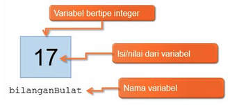
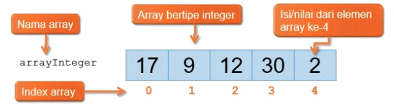
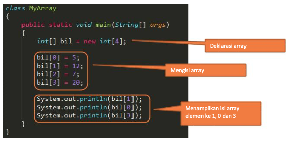
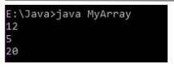

#  Array 1

## Tujuan
1.	Mahasiswa mampu memahami dan menjelaskan fungsi array satu dimensi.
2.	Mahasiswa mampu membuat program dengan menggunakan konsep array satu dimensi.


## Alat dan Bahan

1. PC atau Laptop
2. JDK
3. NetBeans IDE

## Uraian Teori
Array adalah sekumpulan tempat penyimpanan data yang bertipe sama dan memiliki index. Array dapat diibaratkan sebagai 
sekumpulan variabel yang bertipe sama dan bernama sama. Array biasanya digunakan untuk menyimpan deret angka. Kemudian 
untuk membedakan nilai/isi dari variabel tersebut, digunakan index.
Ada dua tipe array:
•	Array satu dimensi
•	Array multi dimensi

Pada jobsheet praktikum ini hanya akan dibahas array satu dimensi saja. Array multi dimensi akan dibahas di jobsheet 
selanjutnya.

### Array Satu Dimensi
Amati ilustrasi tentang variabel berikut ini.

<figure style="text-align: center">
          
          <figcaption style="text-align: center; font-weight: bold">Gambar 1 Variabel</figcaption>
      </figure>

Ilustrasi diatas adalah variabel bertipe integer yang bernama bilanganBulat dan berisi nilai 17. Satu buah variabel 
hanya dapat menyimpan satu buah nilai. Sekarang amati ilustrasi tentang array berikut ini:

<figure style="text-align: center">
          
          <figcaption style="text-align: center; font-weight: bold">Gambar 2 Array satu dimensi</figcaption>
      </figure>

Ilustrasi diatas adalah **array** bertipe **integer** bernama **arrayInteger** dan memiliki kapasitas 5 buah bilangan 
integer. Sebuah array dapat menyimpan lebih dari satu nilai (tergantung dari kapasitasnya). Meskipun begitu, nilai-nilai 
yang disimpan di sebuah array harus bertipe sama. Tiap elemen pada array dinomori dengan index array. **Index array** 
selalu dimulai dari 0 (nol).

### Cara Mendeklarasikan Array
Secara umum, cara mendeklarasikan array adalah sebagai berikut:
```java
tipe[] namaArray = new tipe[kapasitas];
```
- Tipe adalah tipe data dari array yang akan dibuat.
- namaArray adalah nama dari array yang akan dibuat.
- Kapasitas adalah banyaknya nilai yang dapat disimpan didalam array yang akan dibuat.

Untuk mengakses (mengisi/membaca) sebuah elemen dari array, kita hanya perlu menuliskan nama array tersebut, kemudian 
diikuti dengan index yang dituju didalam tanda kurung kotak [ ].

Contoh program berikut ini membuat array bernama bil, bertipe integer, jumlah elemen 4, kemudian mengisinya dengan 
beberapa nilai, kemudian menampilkan isi elemennya ke layar.

<figure style="text-align: center">
          
          <figcaption style="text-align: center; font-weight: bold">Contoh kode Array satu dimensi</figcaption>
      </figure>

Hasil

<figure style="text-align: center">
          
          <figcaption style="text-align: center; font-weight: bold">Hasil</figcaption>
      </figure>

Ada beberapa alternatif cara untuk mendeklarasikan array.
1.	Deklarasi array tanpa mengalokasikan jumlah elemennya:
2.	Deklarasi array dengan mengalokasikan 10 elemen:
3.  Mengubah jumlah elemen array dengan 50: 
4.	Deklarasi array dan mengisinya secara langsung:
5.	Mengetahui jumlah elemen array: 

## Langkah Praktikum
1. Tulis ulang program untuk melakukan perulangan sebagai berikut :
    -   Perulangan dengan `for`
      <figure style="text-align: center">
              
          </figure>
          
    -   Perulangan dengan `while`
    <figure style="text-align: center">
                  
              </figure>
              
    -   Perulangan dengan `do-while`
    <figure style="text-align: center">
                  
              </figure>
2. Cocokkan hasil running program yang sudah Anda buat apakah sudah sesuai dengan tampilan berikut ini?
    <figure style="text-align: center">
                      
                  </figure>
3.	Salinlah program perulangan dengan menggunakan break berikut :
        -   Perulangan dengan `for`
          <figure style="text-align: center">
                  
              </figure>
              
        -   Perulangan dengan `while`
        <figure style="text-align: center">
                      
                  </figure>
                  
        -   Perulangan dengan `do-while`
        <figure style="text-align: center">
                      
                  </figure>
4.	Cocokkan hasil running program looping menggunakan break yang sudah Anda buat apakah sudah sesuai dengan tampilan berikut ini?
    <figure style="text-align: center">
                          
                      </figure>
5. Salinlah program perulangan dengan menggunakan continue berikut :
    <figure style="text-align: center">
                              
                          </figure>
6.	Cocokkan hasil running program looping menggunakan continue yang sudah Anda buat apakah sudah sesuai dengan tampilan berikut ini?
    <figure style="text-align: center">
                              
                          </figure>
                          
### Pertanyaan
1.	Misalkan, Anda diminta membuat sebuah program Java yang meminta masukan sebuah bilangan bulat n. Kemudian, program menampilkan karakter '*' di layar sebanyak n kali. Manakah di antara kedua potongan program di bawah ini yang lebih baik dan aman ? mengapa ?
    
      <figure style="text-align: center">
                                  
                              </figure>
2.	Apakah output dari ketiga potongan program di bawah ini:

      <figure style="text-align: center">
                              
                          </figure>
3.	Salinlah program perulangan berikut, dan cocokkan hasil running program apakah sesuai dengan hasil di bawah ini
    
        <figure style="text-align: center">
                                  
                              </figure>
                              
       - Kembangkan program tersebut sehingga mampu untuk menampilkan output sebagai berikut
            
            <figure style="text-align: center">
                                          
                                      </figure>
                                     
### Tugas
1.	**(SumAvgGenap)** Buatlah program dengan menggunakan bahasa Java yang meminta masukan _user_ sebuah bilangan bulat **N (N > 0)**. Program kemudian menampilkan penjumlahan **N bilangan genap positif pertama (bilangan genap ≥ 0)**.
   
        Contoh: 
       - Jika user memasukkan N = 10, program akan menghitung banyaknya jumlah bilangan positive di dalam range bilangan 1-10   kemudian menampilkan penjumlahan bilangan positive bilangan bilangan diantara 1-10 yaitu : 
            0 + 2 + 4 + 6 + 10 = 30. 
            
            Setelah itu program akan menampilkan rata-rata dari bilangan positive yang telah dijumlahkan tadi.
       - Contoh output program
       
            <figure style="text-align: center">
                
             </figure>
             
         Silakan Anda rancang sendiri untuk tampilan programnya
    
2. **(SumKGanjil)** Buatlah program dengan menggunakan bahasa Java yang meminta masukan user sebuah bilangan bulat **N (N > 0)**. Program kemudian menampilkan penjumlahan **N bilangan ganjil positif pertama (bilangan genap ≥ 0)**.
    
    Contoh: 
    
    - Jika user memasukkan N = 5, program akan menghitung banyaknya jumlah bilangan positive di dalam range bilangan 1-5   kemudian menampilkan penjumlahan kuadrat bilangan ganjil diantara 1-5 yaitu : 
    1<sup>2</sup> + 3<sup>2</sup> + 5<sup>2</sup> = 35. 
    Setelah itu program akan menampilkan rata-rata dari jumlah kuadrat bilangan negatif tersebut.
    - Contoh output program
    
        <figure style="text-align: center">
                                                      
                                                  </figure>
                                                  
3.	**(Fibonacci)** Buatlah sebuah program yang menampilkan deret bilangan sebagai berikut
    <figure style="text-align: center">
                                                          
                                                      </figure>
    
        Dimana bilangan yang terletak di sebelah kiri adalah hasil penambahan dari bilangan di atasnya sebagai contoh
        ```java
        0+1 = 1
        1+1 = 2
        2+1 = 3
        ```     