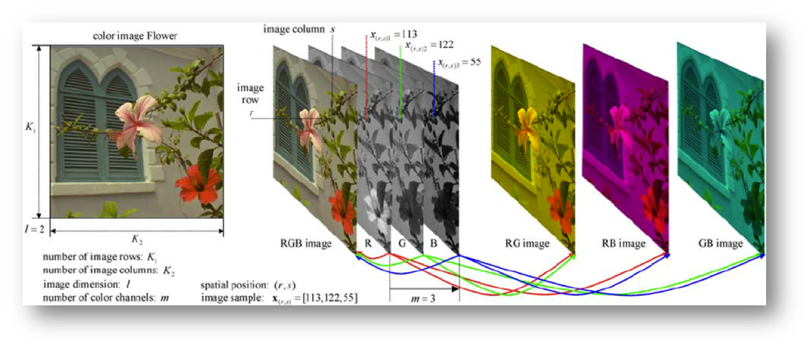
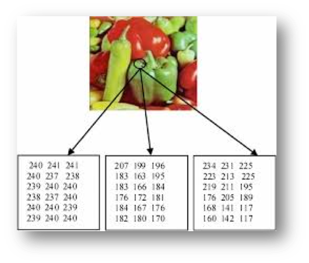
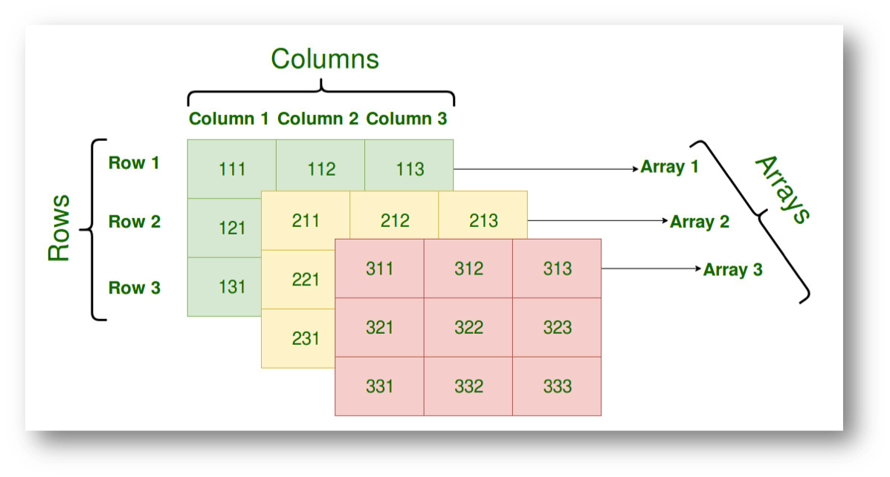
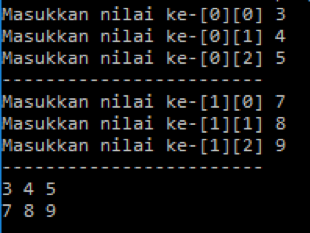
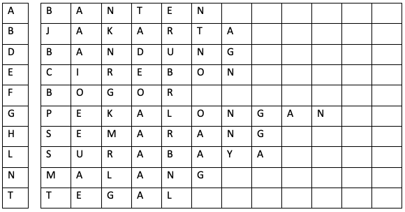
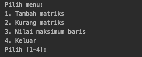

#  Array Multidimensi

## Tujuan
1.	Mahasiswa mampu memahami konsep array 2 dimensi
2.	Mahasiswa mampu membuat program dengan menggunakan konsep array multidimensi.


## Alat dan Bahan

1. PC atau Laptop
2. JDK
3. NetBeans IDE

## Uraian Teori

### Array Dua Dimensi
Array yang telah kita pelajari sebelumnya adalah satu dimensi, yang hanya terdiri dari satu baris elemen. Biasanya untuk
menyajikan sebuah data dalam bentuk tabel, dalam tabel tersebut disajikan dalam bentuk **baris** dan **kolom**. Hal ini yang
menjadi ciri khas dari sebuah array 2 dimensi.

Sebagai contoh
1. Buku tamu yang terdapat di perpustakaan untuk melakukan pencatatan kunjungan pengunjung, dimana dalam buku tamu
tersebut terdapat informasi nim, nama, tanggal kunjungan, dan tanda tangan.
2. Rating film yang dilakukan oleh penonton atau viewer. Masing-masing baris atau record diisi atau dirating oleh
penonton, sedangkan pada bagian kolomnya adalah daftar judul film yang akan dilakukan rating. Visualisasi dapat dilihat
pada tabel di bawah ini

|     | judul_0 | judul_1 | judul_2 |
| --- | ---     | ---     | ---     |
| 0   | 4       | 4       | 3       |
| 1   | 2       | 4       | 3       |
| 2   | 4       | 4       | 3       |
| 3   | 1       | 2       | 2       |
| 4   | 4       | 4       | 4       |

Tabel di atas menggambarkan bahwa setiap view akan melakukan rating terhadap 3 judul film, misalkan pada baris pertama
melakukan rating pada `judul_0=4, judul_1=4, dan judul_2=3`.

> Jadi Array 2 dimensi adalah sebuah array yang penomoran indeksnya menggunakan 2 angka yaitu satu untuk baris dan satu
>lagi untuk kolom, atau sebenarnya array 2 dimensi adalah kumpulan dari array 1 dimensi.

#### Cara Mendeklarasikan Array 2 dimensi
Untuk dapat mendeklarasikan array 2 dimensi mirip dengan 1 dimensi, perbedaanya adalah jumlah kurung siku `[]` atau
subskrip. Pada array 2 dimensi berarti menggunakan 2 kurung siku `[]`, pada java deklarasinya seperti di bawah ini

```java
data_type[][] array_name = new data_type[x][y];
x = jumlah baris
Y = jumlah kolom
Contoh
int[][] arr = new int[10][20];
```

Selain contoh di atas, deklarasi yang lain juga dapat dilakukan seperti di bawah ini
1. `tipe_data[][] nama_variabel`
2. `tipe_data [][]nama_variabel`
3. `tipe_data nama_variabel[][]`   
4. `tipe_data []nama_variabel[]`

Akan tetapi, yang sering kita jumpai atau sering digunakan adalah pada no.1 dan no.3, ketika menggunakan Java adalah 
seperti di bawah ini
```java
int[][] ratings;
int [][]ratings;
int ratings[][];
int []ratings[];
```

#### Inisialisasi Array 2 Dimensi
Untuk memberikan nilai awal pada array 2 dimensi menggunakan operator assigment `=`, ketika melakukan inisialisasi array
2 dimensi kolom pada setiap baris boleh berbeda seperti dicontohkan di bawah ini

```java
int a[][]={
    {1,2,3,4},
    {5,6,7,8},
    {7,8,9,6}
}
int b[][]={
    {1},
    {5,6,7,8},
    {7,8,9}
}
```
Array yang pertama pada `variabel a` kolomnya semua sama antar baris, sedangkan jika kita lihat pada `array b` kolomnya
berbeda. Dalam array 2 multidimensi hal tersebut diperbolehkan. Ketika divisualisasikan ke dalam sebuah tabel seperti di
bawah ini

Visualisasi untuk `array a`

   |     | 0 | 1 | 2 | 3 |
   | --- |---|---|---|---|
   | 0   | 1[0,0] | 2[0,1] | 3[0,2] | 4[0,3] |
   | 1   | 5[1,0] | 6[1,1] | 7[1,2] | 8[1,3] |
   | 2   | 7[2,0] | 8[2,1] | 9[2,2] | 6[2,3] |

Visualisasi untuk `array b`

   |     | 0 | 1 | 2 | 3 |
   | --- |---|---|---|---|
   | 0   | 1[0,0] |  |  |  |
   | 1   | 5[1,0] | 6[1,1] | 7[1,2] | 8[1,3] |
   | 2   | 7[2,0] | 8[2,1] | 9[2,2] |  |

#### Ukuran Baris dan Kolom Array 2 Dimensi
Seriap array baik array 1 dimensi ataupun array 2 dimensi memiliki ukuran, jika pada array 2 dimensi berarti ukuran pada
baris atau kolom. Untuk mengetahui ukuran atau length, bisa menggunakan attribut `length` pada array. Cara penggunaannya
adalah sebagai berikut
```java
int[][] a = new int[3][4];
```
Ketika dipanggil `a.length` maka hasilnya adalah 3(jumlah baris), sedangkan ketika dipanggil `a[0].length` hasilnya
4(jumlah kolom)

>Ketika menggunakan attribut length tentunya akan sangat menguntungkan, baik ketika akan menginputkan element atau
>menampilkan element menggunakan looping atau perulangan pada saat perubahan jumlah baris atau kolom. Kita tidak perlu
> mengubah kode yang ada di dalam looping untuk ukuran baris dan kolomnya.

### Array Tiga Dimensi
Array 3 dimensi merupakan bentuk kompleks dari array multidimensi, seperti pada konsep sebelumnya array 2 dimensi adalah
kumpulan dari array 1 dimensi. Begitu juga dengan array 3 dimensi, yang merupakan kumpulan array 2 dimensi. Contoh
penerapan array 3 dimensi adalah pada gambar berwarna `RGB(Red Green Blue)`. Visualisasinya adalah di bawah ini

<figure style="text-align: center">
          
          <figcaption style="text-align: center; font-weight: bold">RGB</figcaption>
      </figure>

<figure style="text-align: center">
                
                <figcaption style="text-align: center; font-weight: bold">Channel RGB</figcaption>
            </figure>

Dari visualisasi di atas terlihat setiap gambar memiliki 3 channel atau layer yaitu RGB(Red, Green, dan Blue), 3 channel
tersebut yang merepresentasikan array 3 dimensi. Setiap channel, RGB direpresentasikan array 2 dimensi. Jadi sudah
sesuai dengan konsep array 3 dimensi bahwa merupakan kumpulan dari array 2 dimensi.

#### Deklarasi Array 3 Dimensi
Untuk dapat mendeklarasikan array 3 dimensi yaitu dengan menambahkan kurung siku `[]` atau subskrip menjadi 3, `[][][]`.
Secara umum deklarasinya adalah di bawah ini
```java
data_type[][][] array_name = new data_type[x][y][z];
x = index array
y = baris
z = kolom
Contoh: int[][][] arr = new int[10][20][30];
```

#### Inisialisasi Array 3 Dimensi
Untuk memudahkan inisialisasi array 3D, bisa menggunakan representasi array 2D. Atau secara umum dapat digunakan dapat
disajikan seperti di bawah ini
```java
array_name[array_index][baris][kolom] = value;
contoh: arr[0][0][0] = 1;
data_type[][][] array_name = {
	{
	 	{valueA1B1C1, valueA1B1C2, ....},
		{valueA1B2C1, valueA1B2C2, ....}
	},
	{
		{valueA2B1C1, valueA2B1C2, ....},
		{valueA2B2C1, valueA2B2C2, ....}
	}
};
```

Keterangan
- A adalah indek array
- B adalah baris
- C adalah kolom

Ketika diimplementasikan menggunakan Java kurang lebih seperti di bawah ini
```java
int[][][] a = {
	{
	 	{1,2},
		{3,4}
	},
	{
		{5,6},
		{7,8}
	}
};
```
Atau misalkan dilakukan visualisasi adalah seperti di bawah ini
<figure style="text-align: center">
                
                <figcaption style="text-align: center; font-weight: bold">Array 3 Dimensi</figcaption>
            </figure>

## Langkah Praktikum
Ikuti langkah-langkah praktikum berikut ini.
### Praktikum 1
1. Buka editor Netbeans.
2. Buat file bernama `Arr1.java`
3. Buat array bertipe integer dengan nama `nilai` dengan kapasitas baris 2 elemen dan kolom 3 elemen.
    ```java
    int [][] nilai=new int [2][3];
    ```
4. Isi masing-masing elemen array sebagai berikut:
    ```java
    nilai[0][0]=12;
    nilai[0][1]=14;
    nilai[0][2]=34;
    nilai[1][0]=30;
    nilai[1][1]=21;
    nilai[1][2]=67;
    ```
5.	Tampilkan ke layar semua isi elemennya:
   ```java
    System.out.println(nilai[0][0]+" "+nilai[0][1]+" "+nilai[0][2]);
    System.out.println(nilai[1][0]+" "+nilai[1][1]+" "+nilai[1][2]);
   ```
6.	Cocokkan dan amati hasilnya dengan hasil berikut:
   ```xml
    12 14 34
    30 21 67
   ```

### Praktikum 2
1. Buat file baru beri nama `Arr2.java`
2. Buat array bertipe integer dengan nama `nilai` yang mempunyai kapasitas baris 2 elemen dan kolom 3 elemen.
      ```java
        int [][] nilai=new int [2][3];
   ```
3. Isi array tersebut dengan nilai sebaga berikut:
      ```java
        nilai[0][0]=12;
        nilai[0][1]=14;
        nilai[0][2]=34;
        nilai[1][0]=30;
        nilai[1][1]=21;
        nilai[1][2]=67;
      ```
4. Dengan perulangan, tampilkan semua isi array `nilai`.
      ```java
        for (int i=0; i<2; i++){
                   for (int j=0; j<3; j++){
        System.out.print(nilai[i][j] +" ");
        }
        System.out.println(" ");
        }
        ```
5. Cocokkan dan amati hasilnya dengan gambar berikut:
     ```xml
        12 14 34
        30 21 67
      ```
#### Pertanyaan
1. Pada array di atas ada berapa kolom? silakan diubah jumlah kolomnya menjadi 4 serhingga deklarasi array menjadi
    ```java
    int [][] nilai=new int [2][4]
    ```
    Kemudian silakan diisi dengan sembarang nilai terkait penambahan kolom tersebut. Jalankan kembali dan apakah yang
    terjadi?
2. Pada langkah ke-4 kode di atas silakan diubah menjadi seperti di bawah ini
    ```java
    for (int i=0; i<nilai.length; i++){
        for (int j=0; j<nilai[0].length; j++){
            System.out.print(nilai[i][j] +" ");
        }
        System.out.println(" ");
    }
    ```
   Jalankan programnya setelah perubahan tersebut, apa yang terjadi?
3. Masih terkait untuk menampilkan semua element array, silakan kode untuk menampilkan diubah menjadi berikut ini
    ```java
        for (int array1D[]: nilai){
            for (int j : array1D){
                System.out.print(j +" ");
            }
            System.out.println(" ");
        }
      ```
   Jalankan hasilkan perubahan tersebut, apakah yang terjadi?

### Praktikum 3
1.	Buat file baru beri nama `Arr3.java`
2.	Import dan deklarasikan `Scanner` untuk keperluan input.

       ```java
        import java.util.Scanner;
        Scanner input=new Scanner(System.in);
       ```

3.	Buat array bertipe integer dengan nama `nilai` dengan kapasitas baris 2 elemen dan kolom 3 elemen.
        ```java
        int [][] nilai=new int [2][3];
        ```
4.	Menggunakan perulangan, buat input untuk mengisi elemen dari array `nilai`:
        ```java
        for (int i=0; i<2; i++){
        for (int j=0; j<3; j++){
        System.out.print("Masukkan nilai ke-["+i+"]["+j+"] ");
        nilai[i][j]=input.nextInt();
        }
        System.out.println("------------------------");
        }
        ```
5.	Menggunakan perulangan, tampilkan semua isi elemen dari array `nilai`
        ```java
        for (int i=0; i<2; i++){
        for (int j=0; j<3; j++){
        System.out.print(nilai[i][j]+" ");
        }
        System.out.println();
        }
        ```
6.	Cocokkan dan amati hasilnya dengan gambar berikut ini:

        <figure style="text-align: left">
                        
                    </figure>

7.	Lakukan perulangan soal 4 menggunakan `while` atau `do-while`!
8. Ganti kode untuk menampilkan array menjadi `foreach`!
9. Tambahkan kode untuk memasukan jumlah baris dan kolom secara dinamis, dimasukan melalui keyboard!

### Praktikum 4
Pada praktikum ini, kita akan membuat program array dua dimensi dengan kapasitas elemen baris dan kolom menggunakan
inputan keyboard.
1. Buat file baru beri nama `Arr4.java`, jangan lupa untuk memembuat `method main`.
2. Deklarasikan array seperti di bawah ini
    ```java
    int RGB[][][] = {
                    {
                            {2, 2, 3},
                            {5, 6, 7}
                    },
                    {
                            {6, 8, 5},
                            {5, 2, 6}
                    }
            };
    ```
3. Kemudian tampilkan array tersebut menggunakan potongan kode di bawah ini
    ```java
   for (int i = 0; i < 2; i++) {
       for (int j = 0; j < 2; j++) {
           for (int k = 0; k < 3; k++) {
               System.out.print(RGB[i][j][k] + " ");
           }
           System.out.println();
       }
       System.out.println();
   }
    ```
   Jalankan kode tersebut, sehingga akan menampilkan semua elemen array.

#### Pertanyaan
1. Pada langkah ke-1, ganti kode menjadi seperti di bawah ini
    ```java
    int RGB[][][] = {
                    {
                            {2, 2, 3},
                            {5, 6, 7}
                    },
                    {
                            {6, 8, 5},
                            {5, 2}
                    }
            };
    ```
   Jalankan kembali program Anda, apakah yang terjadi?
2. Potongan kode untuk menampilkan array silakan diganti menjadi berikut
    ```java
    for (int i = 0; i < RGB.length; i++) {
       for (int j = 0; j < RGB[1].length; j++) {
          for (int k = 0; k < RGB[0][1].length; k++) {
              System.out.print(RGB[i][j][k] + " ");
          }
          System.out.println();
       }
       System.out.println();
   }
    ```
   Silakan jalankan, outputnya seperti apa?
3. Pada pertanyaan no.2, ubah menjadi seperti berikut
    ```java
    for (int array2D[][] : RGB) {
                for (int array1D[] : array2D) {
                    for (int x : array1D) {
                        System.out.print(x + " ");
                    }
                    System.out.println();
                }
                System.out.println();
            }
    ```
   Jalankan hasil perubahan, bagaimana hasilnya?
4. Dari perubahan-perubahan tersebut untuk menampilkan array 3D, apakah yang dapat Anda simpulkan!

## Tugas
1. Susun program untuk membuat dua buah array berikut isinya sebagai berikut. Array pertama adalah array satu dimensi
`char KODE[10]`, berisi kode plat mobil. Array kedua, array dua dimensi `char KOTA[10][12]` berisi nama kota yang
berpasangan dengan kode plat mobil. Ilustrasi tampilan array tersebut adalah sebagai berikut :

    <figure style="text-align: left">
                
            </figure>

2. Buatlah program dengan tampilan di bawah ini
    <figure style="text-align: left">
                    
                </figure>

    Ketentuan dari program di atas adalah
    - Ukuran matriks ditentukan melalui keyboard
    - Ada pengecekan ketika matriks A dan matriks B memiliki perbedaan ukuran
    - Untuk menghitung nilai maksimal baris pada array, ukuran ditentukan melalui keyboard

3. Dengan menggunakan matriks 3 dimensi, selesaikan kasus seperti berikut ini
    - Sebuah jurusan teknologi informasi pada politeknik terkenal di Malang, memiliki 5 kelas program studi D4 TI.
    Masing-masing kelas memiliki jumlah mahasiswa yang berbeda-beda.
    - Sebuah jurusan teknologi informasi pada politeknik terkenal di Malang, memiliki 5 kelas program studi D4 TI. 
    Masing-masing kelas memiliki jumlah mahasiswa yang dapat ditentukan di awal 
    - Seorang dosen matakuliah `Dasar Pemrograman` berkeinginan untuk menghitung nilai rata-rata setiap mahasiswa
    - nilai rata-rata didapatkan dari perhitungan nilai UTS, UAS, dan project.
    - Buatlah programnya untuk kebutuhan tersebut!

