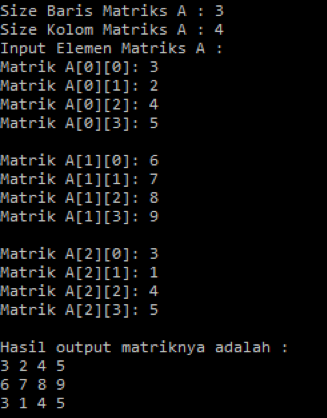
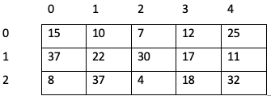

#  Array Multidimensi

## Tujuan
1.	Mahasiswa mampu memahami konsep array 2 dimensi
2.	Mahasiswa mampu membuat program dengan menggunakan konsep array multidimensi.


## Alat dan Bahan

1. PC atau Laptop
2. JDK
3. NetBeans IDE

## Uraian Teori

### Array Dua Dimensi
Array yang telah kita pelajari sebelumnya adalah satu dimensi, yang hanya terdiri dari satu baris elemen. Biasanya untuk
menyajikan sebuah data dalam bentuk tabel, dalam tabel tersebut disajikan dalam bentuk **baris** dan **kolom**. Hal ini yang
menjadi ciri khas dari sebuah array 2 dimensi. 

Sebagai contoh 
1. Buku tamu yang terdapat di perpustakaan untuk melakukan pencatatan kunjungan pengunjung, dimana dalam buku tamu
tersebut terdapat informasi nim, nama, tanggal kunjungan, dan tanda tangan.
2. Rating film yang dilakukan oleh penonton atau viewer. Masing-masing baris atau record diisi atau dirating oleh
penonton, sedangkan pada bagian kolomnya adalah daftar judul film yang akan dilakukan rating. Visualisasi dapat dilihat
pada tabel di bawah ini

|     | judul_0 | judul_1 | judul_2 |
| --- | ---     | ---     | ---     |
| 0   | 4       | 4       | 3       |
| 1   | 2       | 4       | 3       |
| 2   | 4       | 4       | 3       |
| 3   | 1       | 2       | 2       |
| 4   | 4       | 4       | 4       |

Tabel di atas menggambarkan bahwa setiap view akan melakukan rating terhadap 3 judul film, misalkan pada baris pertama
melakukan rating pada `judul_0=4, judul_1=4, dan judul_2=3`.

> Jadi Array 2 dimensi adalah sebuah array yang penomoran indeksnya menggunakan 2 angka yaitu satu untuk baris dan satu
>lagi untuk kolom, atau sebenarnya array 2 dimensi adalah kumpulan dari array 1 dimensi.

#### Cara Mendeklarasikan Array 2 dimensi
Untuk dapat mendeklarasikan array 2 dimensi mirip dengan 1 dimensi, perbedaanya adalah jumlah kurung siku `[]` atau
subskrip. Pada array 2 dimensi berarti menggunakan 2 kurung siku `[]`, pada java deklarasinya seperti di bawah ini

```java
data_type[][] array_name = new data_type[x][y];
x = jumlah baris
Y = jumlah kolom
Contoh
int[][] arr = new int[10][20];
```

Selain contoh di atas, deklarasi yang lain juga dapat dilakukan seperti di bawah ini
1. `tipe_data[][] nama_variabel`
2. `tipe_data [][]nama_variabel`
3. `tipe_data nama_variabel[][]`   
4. `tipe_data []nama_variabel[]`

Akan tetapi, yang sering kita jumpai atau sering digunakan adalah pada no.1 dan no.3, ketika menggunakan Java adalah 
seperti di bawah ini
```java
int[][] ratings;
int [][]ratings;
int ratings[][];
int []ratings[];
```

#### Inisialisasi Array 2 Dimensi
Untuk memberikan nilai awal pada array 2 dimensi menggunakan operator assigment `=`, ketika melakukan inisialisasi array
2 dimensi kolom pada setiap baris boleh berbeda seperti dicontohkan di bawah ini

```java
int a[][]={
    {1,2,3,4},
    {5,6,7,8},
    {7,8,9,6}
}
int b[][]={
    {1},
    {5,6,7,8},
    {7,8,9}
}
```
Array yang pertama pada `variabel a` kolomnya semua sama antar baris, sedangkan jika kita lihat pada `array b` kolomnya
berbeda. Dalam array 2 multidimensi hal tersebut diperbolehkan. Ketika divisualisasikan ke dalam sebuah tabel seperti di
bawah ini

Visualisasi untuk `array a`

   |     | 0 | 1 | 2 | 3 |
   | --- |---|---|---|---|
   | 0   | 1[0,0] | 2[0,1] | 3[0,2] | 4[0,3] |    
   | 1   | 5[1,0] | 6[1,1] | 7[1,2] | 8[1,3] |
   | 2   | 7[2,0] | 8[2,1] | 9[2,2] | 6[2,3] |
   
Visualisasi untuk `array b`
   
   |     | 0 | 1 | 2 | 3 |
   | --- |---|---|---|---|
   | 0   | 1[0,0] |  |  |  |    
   | 1   | 5[1,0] | 6[1,1] | 7[1,2] | 8[1,3] |
   | 2   | 7[2,0] | 8[2,1] | 9[2,2] |  |

#### Ukuran Baris dan Kolom Array 2 Dimensi
Seriap array baik array 1 dimensi ataupun array 2 dimensi memiliki ukuran, jika pada array 2 dimensi berarti ukuran pada
baris atau kolom. Untuk mengetahui ukuran atau length, bisa menggunakan attribut `length` pada array. Cara penggunaannya
adalah sebagai berikut
```java
int[][] a = new int[3][4];
```
Ketika dipanggil `a.length` maka hasilnya adalah 3(jumlah baris), sedangkan ketika dipanggil `a[0].length` hasilnya 
4(jumlah kolom)

>Ketika menggunakan attribut length tentunya akan sangat menguntungkan, baik ketika akan menginputkan element atau
>menampilkan element menggunakan looping atau perulangan pada saat perubahan jumlah baris atau kolom. Kita tidak perlu
> mengubah kode yang ada di dalam looping untuk ukuran baris dan kolomnya.

### Array Tiga Dimensi
Array 3 dimensi merupakan bentuk kompleks dari array multidimensi, seperti pada konsep sebelumnya array 2 dimensi adalah
kumpulan dari array 1 dimensi. Begitu juga dengan array 3 dimensi, yang merupakan kumpulan array 2 dimensi. Contoh
penerapan array 3 dimensi adalah pada gambar berwarna `RGB(Red Green Blue)`. Visualisasinya adalah di bawah ini

<figure style="text-align: center">
          
          <figcaption style="text-align: center; font-weight: bold">RGB</figcaption>
      </figure>
      
<figure style="text-align: center">
                
                <figcaption style="text-align: center; font-weight: bold">Channel RGB</figcaption>
            </figure>
            
Dari visualisasi di atas terlihat setiap gambar memiliki 3 channel atau layer yaitu RGB(Red, Green, dan Blue), 3 channel
tersebut yang merepresentasikan array 3 dimensi. Setiap channel, RGB direpresentasikan array 2 dimensi. Jadi sudah 
sesuai dengan konsep array 3 dimensi bahwa merupakan kumpulan dari array 2 dimensi.

#### Deklarasi Array 3 Dimensi
Untuk dapat mendeklarasikan array 3 dimensi yaitu dengan menambahkan kurung siku `[]` atau subskrip menjadi 3, `[][][]`.
Secara umum deklarasinya adalah di bawah ini
```java
data_type[][][] array_name = new data_type[x][y][z];
x = index array
y = baris
z = kolom
Contoh: int[][][] arr = new int[10][20][30];
```

#### Inisialisasi Array 3 Dimensi
Untuk memudahkan inisialisasi array 3D, bisa menggunakan representasi array 2D. Atau secara umum dapat digunakan dapat
disajikan seperti di bawah ini
```java
array_name[array_index][baris][kolom] = value; 
contoh: arr[0][0][0] = 1;
data_type[][][] array_name = { 
	{
	 	{valueA1B1C1, valueA1B1C2, ....}, 
		{valueA1B2C1, valueA1B2C2, ....} 
	}, 
	{ 
		{valueA2B1C1, valueA2B1C2, ....}, 
		{valueA2B2C1, valueA2B2C2, ....} 
	} 
};
```

Keterangan
- A adalah indek array
- B adalah baris
- C adalah kolom

Ketika diimplementasikan menggunakan Java kurang lebih seperti di bawah ini
```java
int[][][] a = { 
	{
	 	{1,2}, 
		{3,4} 
	}, 
	{ 
		{5,6}, 
		{7,8} 
	} 
};
```
Atau misalkan dilakukan visualisasi adalah seperti di bawah ini
<figure style="text-align: center">
                
                <figcaption style="text-align: center; font-weight: bold">Array 3 Dimensi</figcaption>
            </figure>

## Langkah Praktikum
Ikuti langkah-langkah praktikum berikut ini.
### Praktikum 1
1. Buka editor Netbeans.
2. Buat file bernama `Arr1.java`
3. Buat array bertipe integer dengan nama `nilai` dengan kapasitas baris 2 elemen dan kolom 3 elemen.
    ```java
    int [][] nilai=new int [2][3];
    ```
4. Isi masing-masing elemen array sebagai berikut:
    ```java
    nilai[0][0]=12;
    nilai[0][1]=14;
    nilai[0][2]=34;
    nilai[1][0]=30;
    nilai[1][1]=21;
    nilai[1][2]=67;
    ```
5.	Tampilkan ke layar semua isi elemennya:
   ```java
    System.out.println(nilai[0][0]+" "+nilai[0][1]+" "+nilai[0][2]);
    System.out.println(nilai[1][0]+" "+nilai[1][1]+" "+nilai[1][2]);
   ```
6.	Cocokkan dan amati hasilnya dengan hasil berikut:
   ```xml
    12 14 34
    30 21 67
   ```

### Praktikum 2
1.	Buat file baru beri nama `Arr2.java`
2.	Buat array bertipe integer dengan nama `nilai` yang mempunyai kapasitas baris 2 elemen dan kolom 3 elemen.
        ```java
        int [][] nilai=new int [2][3];
        ```
3.	Isi array tersebut dengan nilai sebaga berikut:
        ```java
        nilai[0][0]=12;
        nilai[0][1]=14;
        nilai[0][2]=34;
        nilai[1][0]=30;
        nilai[1][1]=21;
        nilai[1][2]=67;
        ```
4.	Dengan perulangan, tampilkan semua isi array `nilai`.
        ```java
        for (int i=0; i<2; i++){
                   for (int j=0; j<3; j++){
        System.out.print(nilai[i][j] +" ");
        }
        System.out.println(" ");
        }
        ```
5.	Cocokkan dan amati hasilnya dengan gambar berikut:
        ```xml
        12 14 34
        30 21 67
        ```

### Praktikum 3
1.	Buat file baru beri nama `Arr3.java`
2.	Import dan deklarasikan `Scanner` untuk keperluan input.

       ```java
        import java.util.Scanner;
        Scanner input=new Scanner(System.in);
       ```

3.	Buat array bertipe integer dengan nama `nilai` dengan kapasitas baris 2 elemen dan kolom 3 elemen.
        ```java
        int [][] nilai=new int [2][3];
        ```
4.	Menggunakan perulangan, buat input untuk mengisi elemen dari array `nilai`:
        ```java
        for (int i=0; i<2; i++){
        for (int j=0; j<3; j++){
        System.out.print("Masukkan nilai ke-["+i+"]["+j+"] ");
        nilai[i][j]=input.nextInt();
        }
        System.out.println("------------------------");
        }
        ```
5.	Menggunakan perulangan, tampilkan semua isi elemen dari array `nilai`
        ```java
        for (int i=0; i<2; i++){
        for (int j=0; j<3; j++){
        System.out.print(nilai[i][j]+" ");
        }
        System.out.println();
        }
        ```
6.	Cocokkan dan amati hasilnya dengan gambar berikut ini:

        <figure style="text-align: left">
                        
                    </figure>
            
7.	Lakukan perulangan soal 4 dan 5 menggunakan `while` atau `do-while`!

### Praktikum 4
Pada praktikum ini, kita akan membuat program array dua dimensi dengan kapasitas elemen baris dan kolom menggunakan 
inputan keyboard.
1.	Buat file baru beri nama `Arr4.java`
2.	Import dan deklarasikan Scanner untuk keperluan input:

       ```java
        import java.util.Scanner;
        Scanner input = new Scanner(System.in);
       ```

3. Buatlah dua buah variabel bertipe integer dengan nama `barisA` dan kolom B untuk mendeklarasikan dan menginputkan 
kapasitas elemen baris dan kolom pada array.
      ```java
        int barisA, kolomA;
         System.out.print("Masukkan Size Baris Matriks A : ");
        barisA = input.nextInt();
        System.out.print("Masukkan Size Kolom Matriks A : ");
        kolomA = input.nextInt();
      ```
4.	Buatlah array bertipe integer dengan nama `MatrikA` dengan kapasitas elemen untuk baris dan kolom yang di inputkan.
    ```java
      int[][] MatrikA = new int[barisA][kolomA];
    ```

5.	Menggunakan perulangan, buat input untuk mengisi elemen dari array `MatrikA`:
       ```java
        System.out.println("Input Elemen Matriks A : ");
        for (int i = 0; i < barisA; i++) {
        for (int j = 0; j < kolomA; j++) {
        System.out.print("Matrik A[" + i + "][" + j + "]" + ": ");
        MatrikA[i][j] = input.nextInt();
        }
        System.out.println();
        }
        ```

6.	Menggunakan perulangan, tampilkan semua isi elemen dari array `MatrikA`:
       ```java
        System.out.println("Hasil output matriknya adalah : ");
        for (int i = 0; i < barisA; i++) {
        for (int j = 0; j < kolomA; j++) {
        System.out.print(MatrikA[i][j]+" ");
        }
        System.out.println();
        }
        ```
7.	Cocokkan dan amati hasilnya dengan gambar berikut ini:

        <figure style="text-align: left">
                        
                    </figure>
            
8.	Lakukan perulangan soal 5 dan 6 menggunakan `while` atau `do-while`!

## Tugas
1.	(Nilai MAX). Buatlah program array dua dimensi yang memiliki kapasitas baris dan kolom adalah 3 dan 4. Buatlah 
input untuk mengisi elemen array tersebut mengunakan perulangan, selanjutnya tampilkan nilai MAX dari isi array tersebut.
2.	(Total isi array). Buatlah program array dua dimensi dengan nama Array1[4][5]. Selanjutnya buatlah input 
untuk mengisi elemen array tersebut menggunakan perulangan. Kemudian tampilkan jumlah  total keseluruhan isi Array1 
tersebut!
3.	Buatlah program array dua dimensi yang memiliki kapasitas baris dan kolom diperoleh dari input keyboard. Kemudian 
buatlah input untuk mengisi elemen array tersebut. Selanjutnya buatlah pilihan menu yang terdiri dari:

       - (Nilai MIN). Tampilkan ke layar nilai elemen array yang terkecil.
       - (Nilai MIN & Jumlahnya). Tampilkan ke layar nilai yang terkecil dan berapa buah nilai yang terkecil tersebut dan
         ada dilokasi mana saja nilai terbesar tersebut.  
       - (Kondisi Array). Tampilkan ke layar perkataan “ADA” jika diantara isis array dua dimensi tersebut ada yang 
        nilainya =50, bila tidak ada maka cetak perkataan “TIDAK ADA”.
    
4.	(Nilai Terbesar Baris & Kolom). Buatlah program array dua dimensi yang memiliki kapasitas elemen baris dan kolom 
yaitu 3 dan 5. Kemudian buatlah input untuk mengisi elemen array tersebut menggunakan perulangan. Selanjutnya cetak 
nilai-nilai isi array tersebut yang merupakan nilai terbesar pada barisnya dan merupakan nilai tersbesar pada kolomnya. 
Misalnya isi array tersebut sebagai berikut:

       <figure style="text-align: center">
                        
                    </figure>
            
         Maka output yang di tampilkan pada layar adalah 30 dan 37, karena keduanya merupakan nilai merupakan nilai 
         terbesar pada baris dan kolomnya. Sedangkan 25 hanya terbesar pada barisnya, tapi tidak terbesar pada kolomnya.
5.	(Matrik Transpose). Buatlah program array dua dimensi untuk membuat sebuah matrik dengan kapasitas elemen baris dan 
kolom yang jumlahnya diperoleh dari inputan keyboard. Buatlah input untuk mengisi elemen matrik tersebut menggunakan 
perulangan. Kemudian lakukan transpose pada matrik tersebut. Selanjutnya tampilkan ke layar hasil transposenya. 
6.	Susun program untuk membuat dua buah array berikut isinya sebagai berikut. Array pertama adalah array satu dimensi 
`char KODE[10]`, berisi kode plat mobil. Array kedua, array dua dimensi `char KOTA[10][12]` berisi nama kota yang 
berpasangan dengan kode plat mobil. Ilustrasi tampilan array tersebut adalah sebagai berikut :

<figure style="text-align: center">
                
            </figure>


